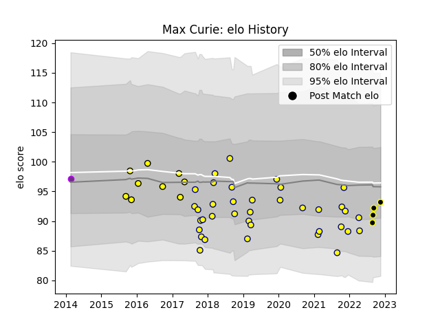

---  
layout: page  
title: Max Curie  
date: 2023-02-02 18:52:20.979827  
categories: player  
---
# Max Curie

## Positions: P

## Current elo: 103.0

## Current Percentile: 58.0

# Elo History

# Match History

| Team           |   Appearances |   Win Rate |
|:---------------|--------------:|-----------:|
| Nevers         |            77 |   0.571429 |
| Albi           |            35 |   0.442857 |
| Mont-de-Marsan |            11 |   0.818182 |
| US Bressane    |             9 |   0.222222 |

| Opponent           |   Matches |   Win Rate |
|:-------------------|----------:|-----------:|
| Carcassonne        |        10 |   0.75     |
| Vannes             |         9 |   0.388889 |
| Beziers            |         9 |   0.333333 |
| Colomiers          |         9 |   0.333333 |
| Aurillac           |         8 |   0.625    |
| Biarritz Olympique |         8 |   0.625    |
| Provence Rugby     |         7 |   0.428571 |
| Mont-de-Marsan     |         7 |   0.714286 |
| Bayonne            |         6 |   0.25     |
| Grenoble           |         6 |   0.583333 |
| Montauban          |         6 |   0.333333 |
| Perpignan          |         5 |   0.6      |
| Narbonne           |         5 |   0.7      |
| Massy              |         5 |   0.8      |
| Dax                |         4 |   0.5      |
| Bourgoin-Jallieu   |         4 |   0.75     |
| US Bressane        |         4 |   0.75     |
| Oyonnax            |         3 |   0.666667 |
| Soyaux-Angouleme   |         3 |   0.666667 |
| Agen               |         3 |   0.666667 |
| Lyon               |         2 |   0        |
| Brive              |         2 |   0        |
| Rouen              |         2 |   1        |
| Tarbes             |         2 |   0.5      |
| La Rochelle        |         1 |   0        |
| Nevers             |         1 |   1        |
| Pau                |         1 |   0        |