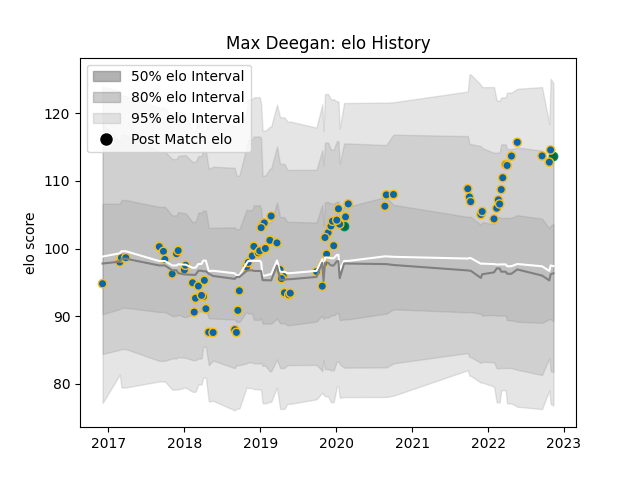

---  
layout: page  
title: Max Deegan  
date: 2022-11-16 11:20:46.786861  
categories: player  
---
# Max Deegan

## Positions: N8, FL

## Country: Ireland

## Current elo: 114.0

## Current Percentile: 89.0

# Elo History

# Match History

| Team     |   Appearances |   Win Rate |
|:---------|--------------:|-----------:|
| Leinster |            81 |   0.790123 |
| Ireland  |             2 |   1        |

| Opponent           |   Matches |   Win Rate |
|:-------------------|----------:|-----------:|
| Dragons            |         9 |   1        |
| Benetton Treviso   |         8 |   0.8125   |
| Connacht           |         7 |   0.857143 |
| Ulster             |         7 |   0.571429 |
| Munster            |         7 |   0.857143 |
| Scarlets           |         6 |   0.75     |
| Zebre              |         5 |   1        |
| Edinburgh          |         5 |   0.6      |
| Glasgow Warriors   |         4 |   0.5      |
| Ospreys            |         3 |   0.666667 |
| Cardiff Blues      |         3 |   0.666667 |
| Southern Kings     |         3 |   1        |
| Stade Toulousain   |         2 |   1        |
| Cheetahs           |         2 |   0.5      |
| Northampton Saints |         2 |   1        |
| Lyon               |         2 |   1        |
| Saracens           |         2 |   0.5      |
| Bulls              |         1 |   1        |
| Sharks             |         1 |   0        |
| Lions              |         1 |   1        |
| Fiji               |         1 |   1        |
| Wales              |         1 |   1        |
| Wasps              |         1 |   1        |