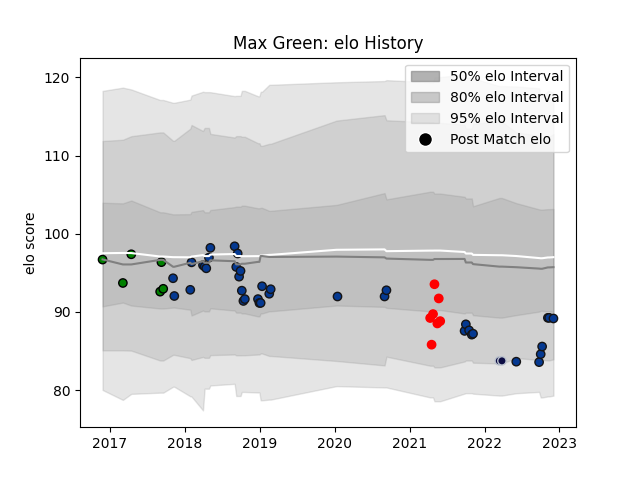

---  
layout: page  
title: Max Green  
date: 2022-12-12 15:16:49.803672  
categories: player  
---
# Max Green

## Positions: SH

## Current elo: 89.0

## Current Percentile: 21.0

# Elo History

# Match History

| Team               |   Appearances |   Win Rate |
|:-------------------|--------------:|-----------:|
| Bath Rugby         |            38 |   0.421053 |
| Jersey             |             7 |   0.571429 |
| Yorkshire Carnegie |             6 |   0.666667 |
| Bristol Rugby      |             2 |   0        |

| Opponent            |   Matches |   Win Rate |
|:--------------------|----------:|-----------:|
| Wasps               |         6 |   0.416667 |
| Leicester Tigers    |         5 |   0.6      |
| London Irish        |         4 |   0.5      |
| Saracens            |         4 |   0        |
| Newcastle Falcons   |         4 |   0.75     |
| Harlequins          |         4 |   0.25     |
| Gloucester Rugby    |         3 |   0.5      |
| Worcester Warriors  |         3 |   0.333333 |
| Exeter Chiefs       |         2 |   0        |
| Ealing Trailfinders |         2 |   0.5      |
| Bristol Rugby       |         2 |   0        |
| Doncaster           |         2 |   0.5      |
| Northampton Saints  |         2 |   0.5      |
| Nottingham          |         2 |   1        |
| Hartpury College    |         1 |   1        |
| London Scottish     |         1 |   0        |
| Ospreys             |         1 |   1        |
| Richmond            |         1 |   1        |
| Coventry            |         1 |   0        |
| Stade Toulousain    |         1 |   0        |
| Cornish Pirates     |         1 |   1        |
| Ampthill            |         1 |   1        |