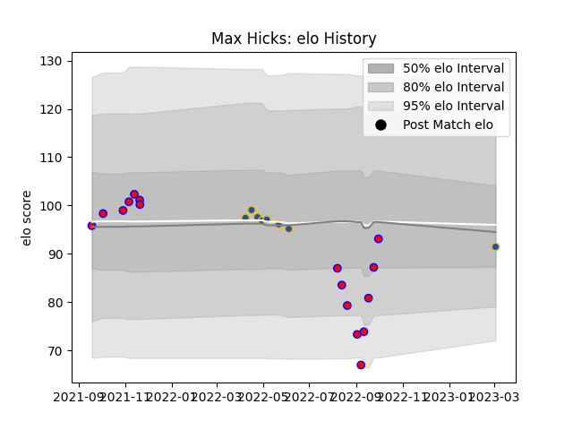

---  
layout: page  
title: Max Hicks  
date: 2023-03-04 11:35:41.513745  
categories: player  
---
# Max Hicks

## Positions: FL, L

## Current elo: 93.0

## Current Percentile: 25.0

# Elo History

# Match History

| Team        |   Appearances |   Win Rate |
|:------------|--------------:|-----------:|
| Tasman      |            16 |   0.5      |
| Highlanders |             7 |   0.428571 |

| Opponent                 |   Matches |   Win Rate |
|:-------------------------|----------:|-----------:|
| Wellington               |         2 |        0.5 |
| Waikato                  |         2 |        0   |
| Southland                |         2 |        1   |
| Hawke's Bay              |         2 |        0.5 |
| Northland                |         2 |        1   |
| North Harbour            |         1 |        0   |
| Taranaki                 |         1 |        1   |
| Queensland Reds          |         1 |        1   |
| Otago                    |         1 |        0   |
| Auckland                 |         1 |        0   |
| Blues                    |         1 |        0   |
| Moana Pasifika           |         1 |        1   |
| Manawatu                 |         1 |        1   |
| Hurricanes               |         1 |        0   |
| Fijian Drua              |         1 |        1   |
| Canterbury               |         1 |        0   |
| Brumbies                 |         1 |        0   |
| New South Wales Waratahs |         1 |        0   |