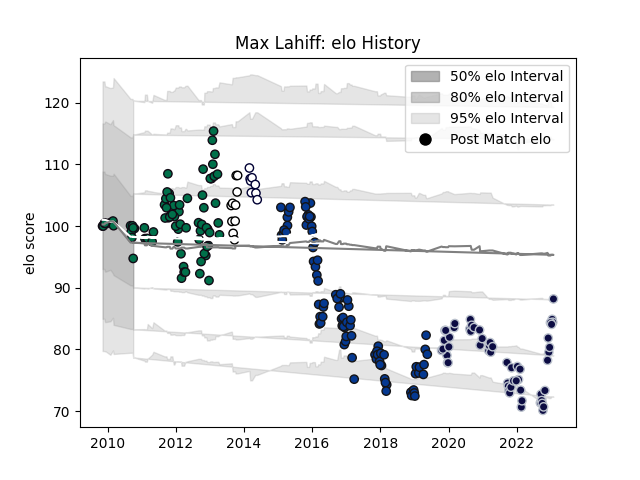

---  
layout: page  
title: Max Lahiff  
date: 2023-03-21 18:18:17.163412  
categories: player  
---
# Max Lahiff

Last updated: 2023-03-21
## Positions: P

## Current elo: 95.0

## Current Percentile: None

# Elo History

# Match History

| Team             |   Appearances |   Win Rate |
|:-----------------|--------------:|-----------:|
| Bath Rugby       |            88 |   0.477273 |
| London Irish     |            77 |   0.435065 |
| Bristol Rugby    |            60 |   0.666667 |
| Hawke's Bay      |            10 |   0.6      |
| Melbourne Rebels |             8 |   0.25     |

| Opponent                 |   Matches |   Win Rate |
|:-------------------------|----------:|-----------:|
| Harlequins               |        22 |   0.5      |
| Wasps                    |        20 |   0.45     |
| Northampton Saints       |        17 |   0.529412 |
| Newcastle Falcons        |        17 |   0.588235 |
| Leicester Tigers         |        16 |   0.3125   |
| Gloucester Rugby         |        15 |   0.433333 |
| Worcester Warriors       |        14 |   0.75     |
| Saracens                 |        13 |   0.307692 |
| Sale Sharks              |        12 |   0.5      |
| Exeter Chiefs            |        11 |   0.181818 |
| Bath Rugby               |        11 |   0.636364 |
| London Irish             |        10 |   0.75     |
| Leinster                 |         5 |   0.2      |
| Bristol Rugby            |         5 |   0.8      |
| Cardiff Blues            |         4 |   0.5      |
| Scarlets                 |         3 |   0        |
| Toulon                   |         3 |   0.333333 |
| Zebre                    |         3 |   1        |
| Brive                    |         3 |   1        |
| New South Wales Waratahs |         2 |   0        |
| London Welsh             |         2 |   0.5      |
| Racing 92                |         2 |   0.5      |
| Perpignan                |         2 |   1        |
| Tasman                   |         2 |   0        |
| Otago                    |         2 |   1        |
| Edinburgh                |         2 |   0        |
| Bordeaux Begles          |         2 |   1        |
| Mont-de-Marsan           |         2 |   1        |
| Yorkshire Carnegie       |         2 |   0.5      |
| Stade Francais Paris     |         2 |   1        |
| Southland                |         1 |   1        |
| Brumbies                 |         1 |   1        |
| Wellington               |         1 |   1        |
| Western Force            |         1 |   0        |
| Stade Toulousain         |         1 |   0        |
| Leeds                    |         1 |   1        |
| Sharks                   |         1 |   0        |
| Cheetahs                 |         1 |   1        |
| Counties Manukau         |         1 |   0        |
| Pau                      |         1 |   1        |
| Ospreys                  |         1 |   0        |
| North Harbour            |         1 |   1        |
| Hurricanes               |         1 |   0        |
| Bay of Plenty            |         1 |   0        |
| Munster                  |         1 |   1        |
| Manawatu                 |         1 |   1        |
| Crusaders                |         1 |   0        |