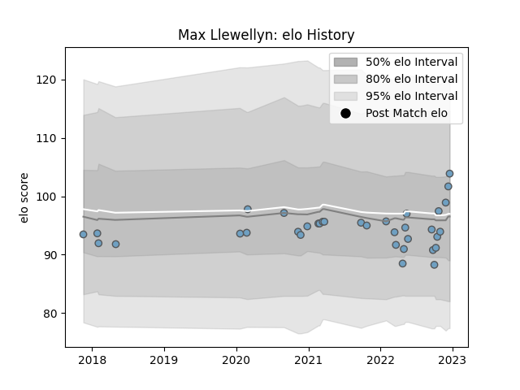

---  
layout: page  
title: Max Llewellyn  
date: 2023-02-24 02:29:52.452561  
categories: player  
---
# Max Llewellyn

## Positions: C

## Current elo: 99.0

## Current Percentile: 74.0

# Elo History

# Match History

| Team          |   Appearances |   Win Rate |
|:--------------|--------------:|-----------:|
| Cardiff Blues |            34 |   0.470588 |

| Opponent          |   Matches |   Win Rate |
|:------------------|----------:|-----------:|
| Dragons           |         4 |   1        |
| Edinburgh         |         4 |   0.25     |
| Ospreys           |         4 |   0.25     |
| Benetton Treviso  |         3 |   0.666667 |
| Munster           |         3 |   0.333333 |
| Leinster          |         2 |   0.5      |
| Stormers          |         2 |   0.5      |
| Lions             |         2 |   0        |
| Connacht          |         2 |   0.5      |
| Calvisano         |         1 |   1        |
| London Irish      |         1 |   0        |
| Leicester Tigers  |         1 |   0        |
| Newcastle Falcons |         1 |   1        |
| Glasgow Warriors  |         1 |   0        |
| Saracens          |         1 |   0        |
| Scarlets          |         1 |   1        |
| Zebre             |         1 |   1        |