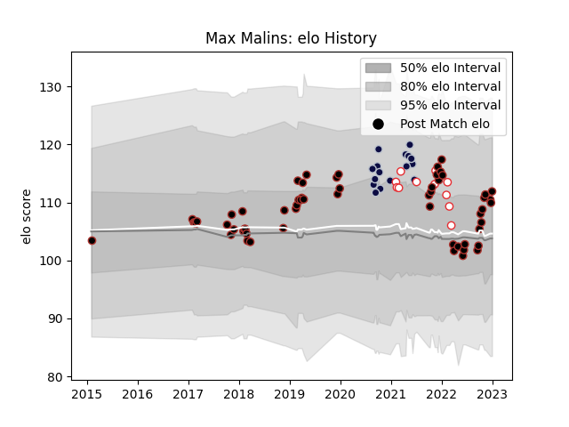

---  
layout: page  
title: Max Malins  
date: 2022-12-18 16:28:29.814040  
categories: player  
---
# Max Malins

## Positions: FB, W

## Country: England

## Current elo: 91.0

## Current Percentile: 34.0

# Elo History

# Match History

| Team          |   Appearances |   Win Rate |
|:--------------|--------------:|-----------:|
| Saracens      |            57 |   0.666667 |
| Bristol Rugby |            17 |   0.647059 |
| England       |            11 |   0.636364 |

| Opponent                 |   Matches |   Win Rate |
|:-------------------------|----------:|-----------:|
| Sale Sharks              |         8 |   0.625    |
| Exeter Chiefs            |         8 |   0.25     |
| Harlequins               |         7 |   0.714286 |
| Gloucester Rugby         |         7 |   0.428571 |
| Leicester Tigers         |         7 |   0.571429 |
| Newcastle Falcons        |         6 |   1        |
| Bath Rugby               |         4 |   0.75     |
| Northampton Saints       |         4 |   1        |
| Bristol Rugby            |         4 |   0.75     |
| Wasps                    |         4 |   0.5      |
| Worcester Warriors       |         3 |   0.666667 |
| Wales                    |         2 |   0.5      |
| Italy                    |         2 |   1        |
| Dragons                  |         2 |   1        |
| Scotland                 |         2 |   0        |
| Munster                  |         2 |   0.5      |
| Toulon                   |         1 |   1        |
| United States of America |         1 |   1        |
| South Africa             |         1 |   1        |
| Scarlets                 |         1 |   1        |
| Australia                |         1 |   1        |
| Lyon                     |         1 |   1        |
| London Welsh             |         1 |   1        |
| Ireland                  |         1 |   0        |
| Glasgow Warriors         |         1 |   1        |
| France                   |         1 |   1        |
| Edinburgh                |         1 |   0        |
| Bordeaux Begles          |         1 |   1        |
| London Irish             |         1 |   1        |