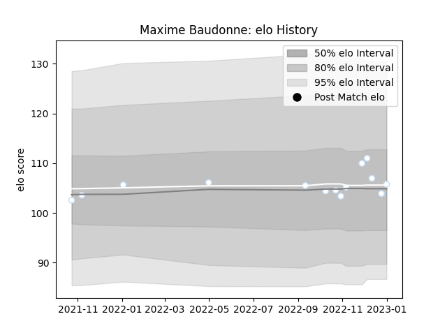

---  
layout: page  
title: Maxime Baudonne  
date: 2023-02-02 18:39:26.815851  
categories: player  
---
# Maxime Baudonne

## Positions: N8, FL

## Current elo: 86.0

## Current Percentile: 19.0

# Elo History

# Match History

| Team      |   Appearances |   Win Rate |
|:----------|--------------:|-----------:|
| Racing 92 |            18 |   0.527778 |

| Opponent             |   Matches |   Win Rate |
|:---------------------|----------:|-----------:|
| Montpellier Herault  |         3 |   0.333333 |
| Brive                |         2 |   0.5      |
| Leinster             |         2 |   0        |
| Pau                  |         2 |   1        |
| Bayonne              |         1 |   0        |
| Castres Olympique    |         1 |   0.5      |
| Clermont Auvergne    |         1 |   1        |
| Harlequins           |         1 |   1        |
| La Rochelle          |         1 |   1        |
| Lyon                 |         1 |   0        |
| Perpignan            |         1 |   1        |
| Stade Francais Paris |         1 |   0        |
| Toulon               |         1 |   1        |