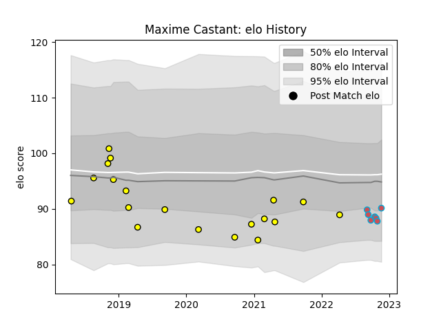

---  
layout: page  
title: Maxime Castant  
date: 2022-12-14 11:37:05.149244  
categories: player  
---
# Maxime Castant

## Positions: H

## Current elo: 91.0

## Current Percentile: 27.0

# Elo History

# Match History

| Team             |   Appearances |   Win Rate |
|:-----------------|--------------:|-----------:|
| Carcassonne      |            19 |   0.263158 |
| Bourgoin-Jallieu |             9 |   0.722222 |

| Opponent                   |   Matches |   Win Rate |
|:---------------------------|----------:|-----------:|
| Mont-de-Marsan             |         2 |       0    |
| Brive                      |         2 |       0.5  |
| Oyonnax                    |         2 |       0    |
| Nevers                     |         2 |       0    |
| Valence Romans Drome Rugby |         2 |       0.25 |
| Beziers                    |         2 |       0.5  |
| Biarritz Olympique         |         1 |       0    |
| US Bressane                |         1 |       1    |
| Tarbes                     |         1 |       0    |
| Rennes                     |         1 |       1    |
| Provence Rugby             |         1 |       1    |
| Perpignan                  |         1 |       0    |
| Bayonne                    |         1 |       0    |
| Narbonne                   |         1 |       1    |
| Carqueiranne-Hyères        |         1 |       1    |
| Montauban                  |         1 |       0    |
| Aurillac                   |         1 |       0    |
| Massy                      |         1 |       1    |
| Dax                        |         1 |       1    |
| Cognac Saint Jean d'Angély |         1 |       1    |
| Chambery                   |         1 |       1    |
| Albi                       |         1 |       0    |