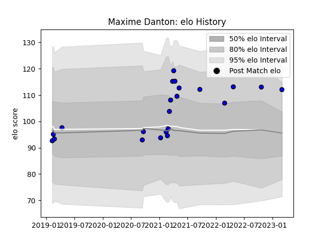

---  
layout: page  
title: Maxime Danton  
date: 2023-03-04 11:41:43.452838  
categories: player  
---
# Maxime Danton

## Positions: FL, N8

## Current elo: 112.0

## Current Percentile: 87.0

# Elo History

# Match History

| Team   |   Appearances |   Win Rate |
|:-------|--------------:|-----------:|
| Massy  |            22 |   0.409091 |

| Opponent                   |   Matches |   Win Rate |
|:---------------------------|----------:|-----------:|
| Dijon                      |         2 |        0.5 |
| Blagnac                    |         2 |        0.5 |
| Bourgoin-Jallieu           |         2 |        0.5 |
| US Bressane                |         2 |        0.5 |
| Suresnes                   |         2 |        1   |
| Nice                       |         1 |        0   |
| Tarbes                     |         1 |        0   |
| Soyaux-Angouleme           |         1 |        1   |
| Provence Rugby             |         1 |        0   |
| Aurillac                   |         1 |        0   |
| Mont-de-Marsan             |         1 |        0   |
| Biarritz Olympique         |         1 |        0   |
| Dax                        |         1 |        1   |
| Cognac Saint Jean d'Angély |         1 |        1   |
| Chambery                   |         1 |        0   |
| Brive                      |         1 |        0   |
| Vannes                     |         1 |        0   |