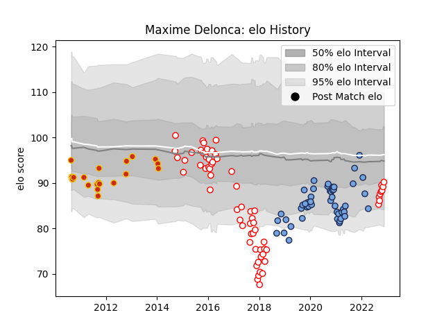

---  
layout: page  
title: Maxime Delonca  
date: 2022-12-18 16:12:56.840136  
categories: player  
---
# Maxime Delonca

## Positions: H

## Current elo: 93.0

## Current Percentile: 35.0

# Elo History

# Match History

| Team      |   Appearances |   Win Rate |
|:----------|--------------:|-----------:|
| Dax       |            68 |   0.441176 |
| Bayonne   |            48 |   0.395833 |
| Perpignan |            21 |   0.547619 |

| Opponent                   |   Matches |   Win Rate |
|:---------------------------|----------:|-----------:|
| Aurillac                   |         6 |   0.5      |
| Toulon                     |         6 |   0.333333 |
| Colomiers                  |         6 |   0.166667 |
| Narbonne                   |         6 |   0.666667 |
| Agen                       |         5 |   0.7      |
| Beziers                    |         5 |   0.2      |
| Biarritz Olympique         |         5 |   0.8      |
| US Bressane                |         5 |   1        |
| Albi                       |         5 |   0.1      |
| Castres Olympique          |         4 |   0.5      |
| Montpellier Herault        |         4 |   0.5      |
| Pau                        |         4 |   0        |
| Racing 92                  |         4 |   0.5      |
| Provence Rugby             |         4 |   0.75     |
| Bourgoin-Jallieu           |         4 |   0.75     |
| Bayonne                    |         4 |   0.375    |
| Montauban                  |         4 |   0.5      |
| Perpignan                  |         3 |   0        |
| Nevers                     |         3 |   0.333333 |
| Stade Francais Paris       |         3 |   0.333333 |
| Vannes                     |         3 |   0.333333 |
| Brive                      |         3 |   0.333333 |
| Carcassonne                |         3 |   0        |
| Grenoble                   |         3 |   0.333333 |
| Bordeaux Begles            |         3 |   0        |
| Stade Toulousain           |         2 |   0.5      |
| Soyaux-Angouleme           |         2 |   0.5      |
| Oyonnax                    |         2 |   0        |
| Clermont Auvergne          |         2 |   0.5      |
| La Rochelle                |         2 |   0        |
| Bizkaia Gernika RT         |         2 |   1        |
| Mont-de-Marsan             |         2 |   0        |
| London Irish               |         2 |   0.5      |
| Rovigo                     |         1 |   1        |
| Blagnac                    |         1 |   1        |
| Valence Romans Drome Rugby |         1 |   1        |
| Scarlets                   |         1 |   0        |
| Suresnes                   |         1 |   1        |
| Carqueiranne-Hyères        |         1 |   1        |
| Rennes                     |         1 |   1        |
| Leicester Tigers           |         1 |   0        |
| Chambery                   |         1 |   1        |
| Nice                       |         1 |   1        |
| Cognac Saint Jean d'Angély |         1 |   1        |
| Munster                    |         1 |   0        |
| Edinburgh                  |         1 |   0        |
| Gloucester Rugby           |         1 |   0        |
| Massy                      |         1 |   1        |
| Lyon                       |         1 |   0        |