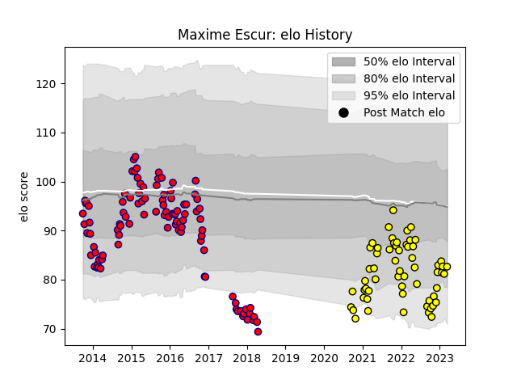

---  
layout: page  
title: Maxime Escur  
date: 2022-12-09 13:09:50.260663  
categories: player  
---
# Maxime Escur

## Positions: P

## Current elo: 82.0

## Current Percentile: 5.0

# Elo History

# Match History

| Team     |   Appearances |   Win Rate |
|:---------|--------------:|-----------:|
| Aurillac |            46 |   0.456522 |
| Albi     |            37 |   0.72973  |

| Opponent                   |   Matches |   Win Rate |
|:---------------------------|----------:|-----------:|
| Tarbes                     |         7 |   0.428571 |
| Bourgoin-Jallieu           |         6 |   0.833333 |
| Dax                        |         5 |   0.6      |
| Mont-de-Marsan             |         5 |   0.4      |
| Suresnes                   |         4 |   0.75     |
| Colomiers                  |         4 |   0.25     |
| Nice                       |         3 |   0.333333 |
| Albi                       |         3 |   0.666667 |
| Narbonne                   |         3 |   1        |
| Chambery                   |         3 |   1        |
| Montauban                  |         3 |   0.666667 |
| Pau                        |         3 |   0.333333 |
| Soyaux-Angouleme           |         3 |   0        |
| Biarritz Olympique         |         3 |   0.666667 |
| US Bressane                |         3 |   0.666667 |
| Aubenas                    |         3 |   1        |
| Agen                       |         2 |   0.5      |
| Dijon                      |         2 |   1        |
| Massy                      |         2 |   1        |
| Cognac Saint Jean d'Angély |         2 |   1        |
| Carcassonne                |         2 |   0.5      |
| Beziers                    |         2 |   0.5      |
| Valence Romans Drome Rugby |         2 |   0.5      |
| Lyon                       |         1 |   0        |
| Nevers                     |         1 |   0        |
| Carqueiranne-Hyères        |         1 |   0        |
| Perpignan                  |         1 |   1        |
| Provence Rugby             |         1 |   0        |
| Blagnac                    |         1 |   0        |
| Bayonne                    |         1 |   0        |
| Auch                       |         1 |   1        |