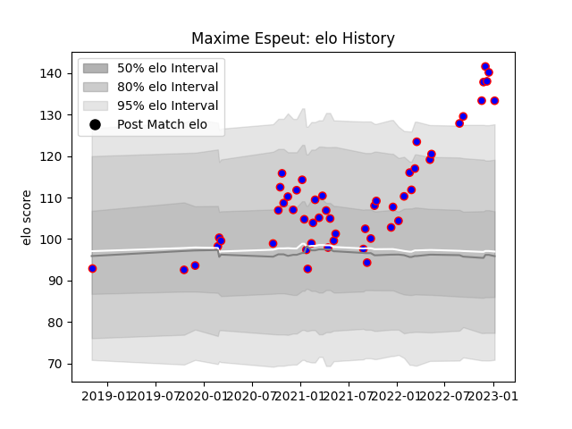

---  
layout: page  
title: Maxime Espeut  
date: 2022-12-09 13:05:43.146082  
categories: player  
---
# Maxime Espeut

## Positions: W, C

## Current elo: 135.0

## Current Percentile: 99.0

# Elo History

# Match History

| Team    |   Appearances |   Win Rate |
|:--------|--------------:|-----------:|
| Beziers |            44 |   0.420455 |

| Opponent                   |   Matches |   Win Rate |
|:---------------------------|----------:|-----------:|
| Vannes                     |         6 |   0.166667 |
| Carcassonne                |         4 |   0.25     |
| Grenoble                   |         4 |   0.5      |
| Nevers                     |         4 |   0.25     |
| Aurillac                   |         3 |   0.666667 |
| Rouen                      |         3 |   0.666667 |
| Provence Rugby             |         3 |   0.333333 |
| Oyonnax                    |         3 |   0        |
| Agen                       |         3 |   1        |
| Colomiers                  |         2 |   0.5      |
| Bayonne                    |         2 |   0.5      |
| Valence Romans Drome Rugby |         2 |   0.75     |
| Mont-de-Marsan             |         1 |   0        |
| Perpignan                  |         1 |   0        |
| Biarritz Olympique         |         1 |   1        |
| Soyaux-Angouleme           |         1 |   0        |
| Montauban                  |         1 |   1        |