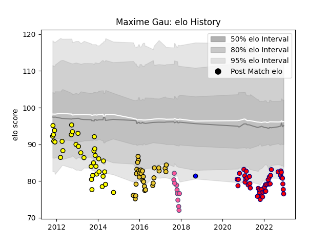

---  
layout: page  
title: Maxime Gau  
date: 2023-01-17 11:35:52.646254  
categories: player  
---
# Maxime Gau

## Positions: H, P

## Current elo: 83.0

## Current Percentile: 16.0

# Elo History

# Match History

| Team                       |   Appearances |   Win Rate |
|:---------------------------|--------------:|-----------:|
| Albi                       |            77 |   0.422078 |
| Cognac Saint Jean d'Angély |            44 |   0.284091 |
| La Rochelle                |            33 |   0.484848 |
| Stade Francais Paris       |            10 |   0.3      |
| Massy                      |             5 |   0        |

| Opponent                   |   Matches |   Win Rate |
|:---------------------------|----------:|-----------:|
| Tarbes                     |        10 |   0.25     |
| Pau                        |        10 |   0.4      |
| Dax                        |         9 |   0.666667 |
| Narbonne                   |         8 |   0.25     |
| Oyonnax                    |         7 |   0.571429 |
| Massy                      |         6 |   0.5      |
| Lyon                       |         6 |   0.333333 |
| Bourgoin-Jallieu           |         6 |   0.5      |
| Mont-de-Marsan             |         5 |   0        |
| Agen                       |         5 |   0.2      |
| Aurillac                   |         5 |   0.5      |
| Beziers                    |         5 |   0.4      |
| Blagnac                    |         5 |   0.4      |
| Carcassonne                |         4 |   0.25     |
| La Rochelle                |         4 |   0.5      |
| Nice                       |         4 |   0.25     |
| Suresnes                   |         4 |   0.25     |
| Albi                       |         4 |   0.25     |
| Bordeaux Begles            |         4 |   0.5      |
| Provence Rugby             |         4 |   0.5      |
| Grenoble                   |         4 |   0.75     |
| Brive                      |         4 |   0        |
| US Bressane                |         3 |   0.333333 |
| Gloucester Rugby           |         3 |   0        |
| Dijon                      |         3 |   1        |
| Colomiers                  |         3 |   0.833333 |
| Clermont Auvergne          |         3 |   0.166667 |
| Soyaux-Angouleme           |         3 |   0        |
| Racing 92                  |         2 |   0.75     |
| Aubenas                    |         2 |   0        |
| Stade Toulousain           |         2 |   0.5      |
| Valence Romans Drome Rugby |         2 |   0        |
| Worcester Warriors         |         2 |   0.5      |
| Toulon                     |         2 |   0.5      |
| Zebre                      |         2 |   0.5      |
| Auch                       |         2 |   0.25     |
| Périgueux                  |         1 |   1        |
| Rennes                     |         1 |   0        |
| Stade Francais Paris       |         1 |   1        |
| Carqueiranne-Hyères        |         1 |   0        |
| Montpellier Herault        |         1 |   0        |
| Montauban                  |         1 |   0        |
| London Irish               |         1 |   0        |
| Krasny Yar                 |         1 |   0        |
| Chambery                   |         1 |   1        |
| Vannes                     |         1 |   0        |
| Castres Olympique          |         1 |   1        |
| Nevers                     |         1 |   0        |