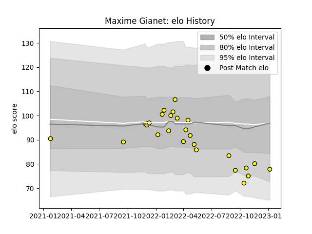

---  
layout: page  
title: Maxime Gianet  
date: 2023-02-02 19:10:54.299533  
categories: player  
---
# Maxime Gianet

## Positions: FB

## Current elo: 87.0

## Current Percentile: 25.0

# Elo History

# Match History

| Team        |   Appearances |   Win Rate |
|:------------|--------------:|-----------:|
| Carcassonne |            28 |   0.517857 |

| Opponent         |   Matches |   Win Rate |
|:-----------------|----------:|-----------:|
| Colomiers        |         3 |   0.333333 |
| Oyonnax          |         3 |   0        |
| Rouen            |         3 |   1        |
| Aurillac         |         2 |   1        |
| Bayonne          |         2 |   0.5      |
| Beziers          |         2 |   1        |
| Grenoble         |         2 |   0.25     |
| Narbonne         |         2 |   1        |
| Vannes           |         2 |   0.5      |
| Agen             |         1 |   0        |
| Mont-de-Marsan   |         1 |   0        |
| Montauban        |         1 |   1        |
| Nevers           |         1 |   0        |
| Provence Rugby   |         1 |   0        |
| Soyaux-Angouleme |         1 |   0        |
| US Bressane      |         1 |   1        |