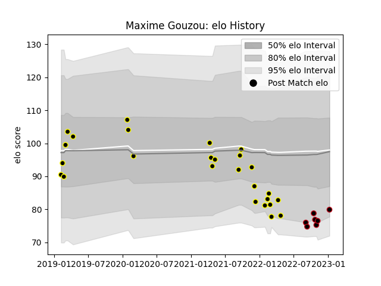

---  
layout: page  
title: Maxime Gouzou  
date: 2023-01-13 11:34:48.572512  
categories: player  
---
# Maxime Gouzou

## Positions: N8

## Current elo: 80.0

## Current Percentile: 7.0

# Elo History

# Match History

| Team           |   Appearances |   Win Rate |
|:---------------|--------------:|-----------:|
| Mont-de-Marsan |            26 |   0.730769 |
| Lyon           |             7 |   0.714286 |

| Opponent            |   Matches |   Win Rate |
|:--------------------|----------:|-----------:|
| Aurillac            |         4 |   1        |
| Beziers             |         3 |   0.333333 |
| Oyonnax             |         3 |   0.333333 |
| Agen                |         2 |   1        |
| Rouen               |         2 |   1        |
| Perpignan           |         2 |   0.5      |
| Pau                 |         2 |   1        |
| Montauban           |         2 |   1        |
| Vannes              |         2 |   0.5      |
| Grenoble            |         1 |   0        |
| Colomiers           |         1 |   0        |
| Massy               |         1 |   1        |
| Castres Olympique   |         1 |   1        |
| Montpellier Herault |         1 |   1        |
| Carcassonne         |         1 |   1        |
| Brive               |         1 |   1        |
| Biarritz Olympique  |         1 |   1        |
| Provence Rugby      |         1 |   1        |
| Bayonne             |         1 |   1        |
| La Rochelle         |         1 |   0        |