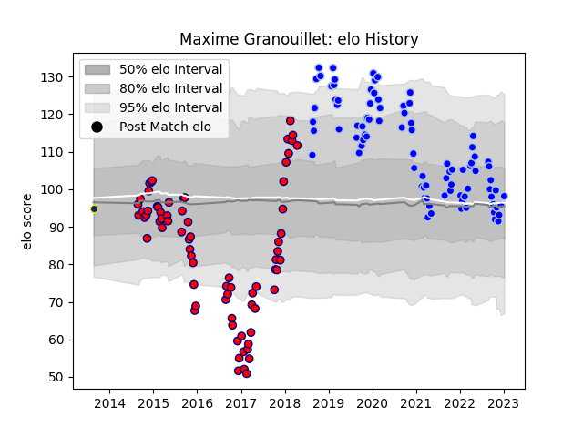

---  
layout: page  
title: Maxime Granouillet  
date: 2023-01-13 11:24:57.908795  
categories: player  
---
# Maxime Granouillet

## Positions: L

## Current elo: 98.0

## Current Percentile: 37.0

# Elo History

# Match History

| Team              |   Appearances |   Win Rate |
|:------------------|--------------:|-----------:|
| Colomiers         |            87 |   0.626437 |
| Aurillac          |            73 |   0.520548 |
| Clermont Auvergne |             1 |   1        |

| Opponent                   |   Matches |   Win Rate |
|:---------------------------|----------:|-----------:|
| Beziers                    |        12 |   0.666667 |
| Carcassonne                |        11 |   0.454545 |
| Mont-de-Marsan             |        10 |   0.6      |
| Montauban                  |        10 |   0.4      |
| Provence Rugby             |         8 |   0.75     |
| Nevers                     |         8 |   0.75     |
| Vannes                     |         8 |   0.5      |
| Biarritz Olympique         |         8 |   0.625    |
| Grenoble                   |         7 |   0.857143 |
| Oyonnax                    |         6 |   0.583333 |
| Rouen                      |         6 |   0.833333 |
| Aurillac                   |         6 |   0.5      |
| Narbonne                   |         6 |   0.5      |
| Agen                       |         6 |   0.666667 |
| Bayonne                    |         5 |   0.2      |
| Bourgoin-Jallieu           |         5 |   0.5      |
| Perpignan                  |         5 |   0.7      |
| Dax                        |         5 |   0.4      |
| Colomiers                  |         5 |   0.6      |
| Massy                      |         4 |   0.5      |
| Soyaux-Angouleme           |         4 |   0.5      |
| Albi                       |         3 |   0.666667 |
| Tarbes                     |         3 |   0.666667 |
| US Bressane                |         3 |   0.333333 |
| Pau                        |         2 |   0.5      |
| Valence Romans Drome Rugby |         2 |   0.5      |
| Lyon                       |         1 |   1        |
| Roval Drome XV             |         1 |   1        |
| Brive                      |         1 |   0        |