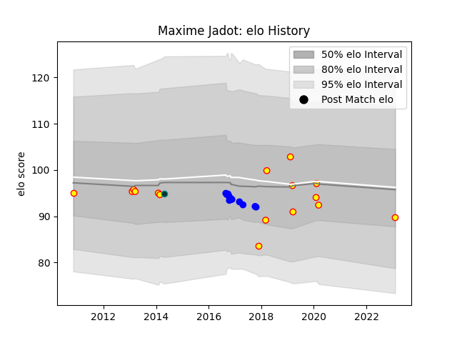

---  
layout: page  
title: Maxime Jadot  
date: 2023-02-05 15:11:28.064795  
categories: player  
---
# Maxime Jadot

## Positions: P

## Country: Belgium

## Current elo: 90.0

## Current Percentile: None

# Elo History

# Match History

| Team    |   Appearances |   Win Rate |
|:--------|--------------:|-----------:|
| Belgium |            16 |      0.25  |
| Vannes  |            12 |      0.375 |
| Pau     |             1 |      1     |

| Opponent           |   Matches |   Win Rate |
|:-------------------|----------:|-----------:|
| Portugal           |         4 |   0        |
| Spain              |         3 |   0.333333 |
| Carcassonne        |         2 |   0.5      |
| Russia             |         2 |   0.5      |
| Georgia            |         2 |   0        |
| Agen               |         2 |   0.25     |
| Germany            |         2 |   1        |
| Colomiers          |         1 |   0        |
| Dax                |         1 |   0        |
| Canada             |         1 |   0        |
| Albi               |         1 |   1        |
| Grenoble           |         1 |   0        |
| Mont-de-Marsan     |         1 |   0        |
| Montauban          |         1 |   1        |
| Narbonne           |         1 |   0        |
| Perpignan          |         1 |   1        |
| Brazil             |         1 |   0        |
| Romania            |         1 |   0        |
| Biarritz Olympique |         1 |   1        |