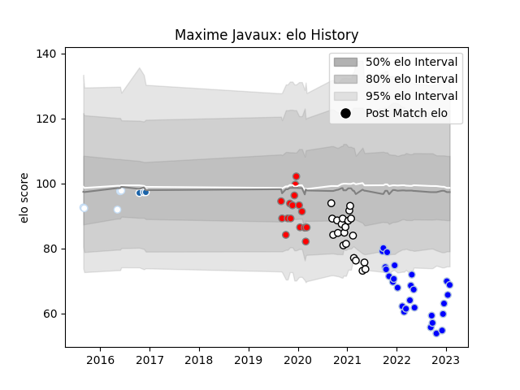

---  
layout: page  
title: Maxime Javaux  
date: 2023-02-02 19:05:19.692473  
categories: player  
---
# Maxime Javaux

## Positions: FH

## Current elo: 69.0

## Current Percentile: 2.0

# Elo History

# Match History

| Team                       |   Appearances |   Win Rate |
|:---------------------------|--------------:|-----------:|
| Colomiers                  |            28 |   0.535714 |
| Valence Romans Drome Rugby |            21 |   0.333333 |
| Roval Drome XV             |            16 |   0.1875   |
| Racing 92                  |             5 |   0.6      |
| Castres Olympique          |             3 |   0.666667 |

| Opponent            |   Matches |   Win Rate |
|:--------------------|----------:|-----------:|
| Montauban           |         6 |   0.333333 |
| Beziers             |         5 |   0.1      |
| Provence Rugby      |         5 |   0.2      |
| Agen                |         4 |   0.5      |
| Aurillac            |         4 |   0.25     |
| Soyaux-Angouleme    |         4 |   0.625    |
| Mont-de-Marsan      |         4 |   0.5      |
| Vannes              |         4 |   0.25     |
| Biarritz Olympique  |         4 |   0.5      |
| Grenoble            |         3 |   0.333333 |
| Rouen               |         3 |   0.666667 |
| Oyonnax             |         3 |   0        |
| Nevers              |         3 |   0.333333 |
| Colomiers           |         3 |   0.333333 |
| Carcassonne         |         3 |   0.666667 |
| Perpignan           |         2 |   0        |
| La Rochelle         |         2 |   1        |
| Bayonne             |         2 |   0.5      |
| US Bressane         |         2 |   0.5      |
| Brive               |         1 |   0        |
| Montpellier Herault |         1 |   1        |
| Massy               |         1 |   1        |
| Lyon                |         1 |   1        |
| Leinster            |         1 |   0        |
| Toulon              |         1 |   1        |
| Narbonne            |         1 |   1        |