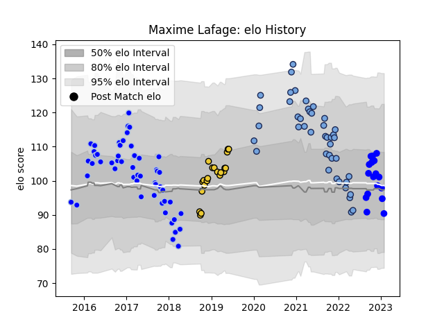

---  
layout: page  
title: Maxime Lafage  
date: 2022-11-22 11:47:30.010162  
categories: player  
---
# Maxime Lafage

## Positions: FH

## Current elo: 92.0

## Current Percentile: 44.0

# Elo History

# Match History

| Team        |   Appearances |   Win Rate |
|:------------|--------------:|-----------:|
| Colomiers   |            35 |   0.642857 |
| Bayonne     |            34 |   0.5      |
| La Rochelle |            21 |   0.761905 |
| Vannes      |            11 |   0.636364 |

| Opponent             |   Matches |   Win Rate |
|:---------------------|----------:|-----------:|
| Agen                 |         8 |   0.5      |
| Beziers              |         5 |   0.6      |
| Bordeaux Begles      |         5 |   0.2      |
| Montpellier Herault  |         4 |   0.5      |
| Biarritz Olympique   |         4 |   1        |
| Stade Toulousain     |         4 |   0.5      |
| Carcassonne          |         4 |   0.5      |
| Perpignan            |         4 |   0.75     |
| Vannes               |         3 |   1        |
| Toulon               |         3 |   1        |
| Stade Francais Paris |         3 |   0.666667 |
| Soyaux-Angouleme     |         3 |   0.666667 |
| Racing 92            |         3 |   1        |
| Oyonnax              |         3 |   0.333333 |
| Montauban            |         3 |   0.333333 |
| Grenoble             |         3 |   0.666667 |
| Bayonne              |         3 |   0.333333 |
| Dax                  |         3 |   0.666667 |
| RC Enisei            |         2 |   1        |
| Rouen                |         2 |   0.5      |
| Colomiers            |         2 |   0.5      |
| Lyon                 |         2 |   0.5      |
| Provence Rugby       |         2 |   1        |
| Pau                  |         2 |   0        |
| Nevers               |         2 |   0.75     |
| Narbonne             |         2 |   1        |
| Aurillac             |         2 |   1        |
| Mont-de-Marsan       |         2 |   0.5      |
| Massy                |         2 |   1        |
| Castres Olympique    |         2 |   0        |
| Bristol Rugby        |         1 |   1        |
| US Bressane          |         1 |   1        |
| Tarbes               |         1 |   0        |
| Leicester Tigers     |         1 |   0        |
| Clermont Auvergne    |         1 |   1        |
| Sale Sharks          |         1 |   1        |
| La Rochelle          |         1 |   0        |
| Albi                 |         1 |   1        |
| Zebre                |         1 |   1        |