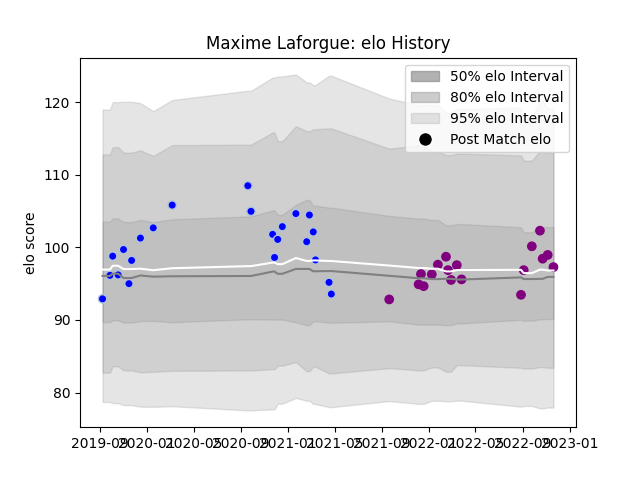

---  
layout: page  
title: Maxime Laforgue  
date: 2022-12-14 11:30:44.193993  
categories: player  
---
# Maxime Laforgue

## Positions: W

## Current elo: 94.0

## Current Percentile: 55.0

# Elo History

# Match History

| Team             |   Appearances |   Win Rate |
|:-----------------|--------------:|-----------:|
| Colomiers        |            23 |   0.630435 |
| Soyaux-Angouleme |            19 |   0.631579 |

| Opponent                   |   Matches |   Win Rate |
|:---------------------------|----------:|-----------:|
| Beziers                    |         5 |   0.8      |
| Montauban                  |         3 |   0.666667 |
| Nevers                     |         3 |   0.666667 |
| Vannes                     |         2 |   0.5      |
| Oyonnax                    |         2 |   0.25     |
| Valence Romans Drome Rugby |         2 |   0.5      |
| Aurillac                   |         2 |   1        |
| Rouen                      |         2 |   0.5      |
| Grenoble                   |         2 |   0        |
| Massy                      |         2 |   0.5      |
| Perpignan                  |         2 |   0        |
| Tarbes                     |         1 |   1        |
| Suresnes                   |         1 |   1        |
| Soyaux-Angouleme           |         1 |   0        |
| Roval Drome XV             |         1 |   1        |
| Provence Rugby             |         1 |   1        |
| Agen                       |         1 |   1        |
| Albi                       |         1 |   1        |
| Dijon                      |         1 |   1        |
| Dax                        |         1 |   0        |
| Cognac Saint Jean d'Angély |         1 |   1        |
| Carcassonne                |         1 |   1        |
| Bourgoin-Jallieu           |         1 |   1        |
| Biarritz Olympique         |         1 |   0        |
| Aubenas                    |         1 |   1        |
| Mont-de-Marsan             |         1 |   1        |