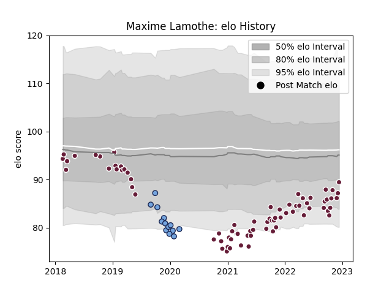

---  
layout: page  
title: Maxime Lamothe  
date: 2022-12-14 11:20:37.164780  
categories: player  
---
# Maxime Lamothe

## Positions: H

## Current elo: 90.0

## Current Percentile: 16.0

# Elo History

# Match History

| Team            |   Appearances |   Win Rate |
|:----------------|--------------:|-----------:|
| Bordeaux Begles |            71 |   0.549296 |
| Bayonne         |            13 |   0.269231 |

| Opponent             |   Matches |   Win Rate |
|:---------------------|----------:|-----------:|
| Montpellier Herault  |         8 |   0.625    |
| Clermont Auvergne    |         7 |   0.571429 |
| Lyon                 |         7 |   0.428571 |
| Toulon               |         6 |   0.333333 |
| Stade Toulousain     |         6 |   0.333333 |
| Stade Francais Paris |         6 |   0.833333 |
| La Rochelle          |         5 |   0.2      |
| Brive                |         5 |   0.7      |
| Racing 92            |         5 |   0.8      |
| Perpignan            |         5 |   0.6      |
| Agen                 |         4 |   0.5      |
| Castres Olympique    |         4 |   0.75     |
| Bayonne              |         3 |   0.666667 |
| Pau                  |         3 |   0.666667 |
| Connacht             |         2 |   0        |
| Grenoble             |         1 |   1        |
| Gloucester Rugby     |         1 |   0        |
| Oyonnax              |         1 |   0        |
| Sale Sharks          |         1 |   0        |
| Scarlets             |         1 |   0        |
| Bordeaux Begles      |         1 |   0        |
| Biarritz Olympique   |         1 |   0        |
| London Irish         |         1 |   0        |