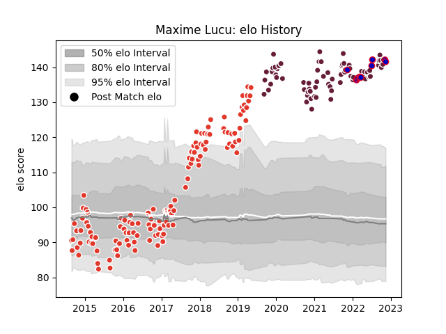

---  
layout: page  
title: Maxime Lucu  
date: 2023-01-06 00:23:01.406789  
categories: player  
---
# Maxime Lucu

## Positions: SH

## Country: France

## Current elo: 143.0

## Current Percentile: 99.0

# Elo History

# Match History

| Team               |   Appearances |   Win Rate |
|:-------------------|--------------:|-----------:|
| Biarritz Olympique |           141 |   0.556738 |
| Bordeaux Begles    |            77 |   0.655844 |
| France             |            13 |   1        |

| Opponent             |   Matches |   Win Rate |
|:---------------------|----------:|-----------:|
| Perpignan            |        11 |   0.454545 |
| Montauban            |        10 |   0.5      |
| Bayonne              |        10 |   0.7      |
| Colomiers            |        10 |   0.4      |
| Mont-de-Marsan       |         9 |   0.666667 |
| Aurillac             |         9 |   0.555556 |
| Beziers              |         9 |   0.666667 |
| Narbonne             |         8 |   0.875    |
| Dax                  |         8 |   0.625    |
| Agen                 |         7 |   0.714286 |
| Montpellier Herault  |         7 |   0.642857 |
| Carcassonne          |         7 |   0.571429 |
| Brive                |         7 |   0.5      |
| Castres Olympique    |         6 |   0.916667 |
| Racing 92            |         6 |   0.833333 |
| Pau                  |         6 |   0.5      |
| Soyaux-Angouleme     |         6 |   0.5      |
| Stade Francais Paris |         6 |   0.833333 |
| Stade Toulousain     |         6 |   0.333333 |
| Vannes               |         6 |   0.333333 |
| Massy                |         6 |   0.666667 |
| Lyon                 |         6 |   0.666667 |
| Albi                 |         5 |   0.4      |
| La Rochelle          |         5 |   0.4      |
| Clermont Auvergne    |         5 |   0.8      |
| Bourgoin-Jallieu     |         5 |   0.8      |
| Nevers               |         4 |   0.5      |
| Toulon               |         4 |   0.5      |
| Tarbes               |         4 |   0.5      |
| Provence Rugby       |         4 |   0.5      |
| Oyonnax              |         4 |   0.75     |
| Edinburgh            |         3 |   0.833333 |
| Japan                |         3 |   1        |
| Grenoble             |         2 |   0.5      |
| Biarritz Olympique   |         2 |   0.5      |
| US Bressane          |         2 |   0.5      |
| New Zealand          |         1 |   1        |
| England              |         1 |   1        |
| Georgia              |         1 |   1        |
| Leicester Tigers     |         1 |   0        |
| Gloucester Rugby     |         1 |   0        |
| Bristol Rugby        |         1 |   0        |
| Scotland             |         1 |   1        |
| South Africa         |         1 |   1        |
| Australia            |         1 |   1        |
| Ireland              |         1 |   1        |
| Italy                |         1 |   1        |
| Argentina            |         1 |   1        |
| Wales                |         1 |   1        |