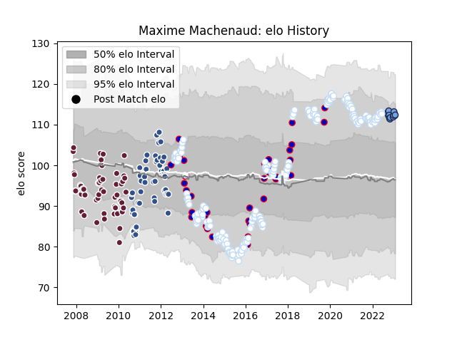

---  
layout: page  
title: Maxime Machenaud  
date: 2022-12-28 12:53:31.331444  
categories: player  
---
# Maxime Machenaud

## Positions: SH

## Country: France

## Current elo: 102.0

## Current Percentile: 71.0

# Elo History

# Match History

| Team            |   Appearances |   Win Rate |
|:----------------|--------------:|-----------:|
| Racing 92       |           230 |   0.645652 |
| Bordeaux Begles |            52 |   0.451923 |
| Agen            |            51 |   0.460784 |
| France          |            39 |   0.423077 |
| Bayonne         |             8 |   0.6875   |

| Opponent                 |   Matches |   Win Rate |
|:-------------------------|----------:|-----------:|
| Clermont Auvergne        |        24 |   0.583333 |
| Toulon                   |        23 |   0.565217 |
| Castres Olympique        |        20 |   0.55     |
| Bordeaux Begles          |        20 |   0.65     |
| La Rochelle              |        20 |   0.55     |
| Stade Toulousain         |        20 |   0.5      |
| Stade Francais Paris     |        19 |   0.526316 |
| Montpellier Herault      |        18 |   0.583333 |
| Lyon                     |        16 |   0.5      |
| Brive                    |        15 |   0.7      |
| Bayonne                  |        12 |   0.75     |
| Pau                      |        12 |   0.75     |
| Grenoble                 |        11 |   0.590909 |
| Oyonnax                  |        10 |   0.4      |
| Agen                     |         9 |   0.666667 |
| Perpignan                |         8 |   0.8125   |
| Racing 92                |         7 |   0.285714 |
| Munster                  |         6 |   0.666667 |
| Saracens                 |         6 |   0.333333 |
| New Zealand              |         5 |   0        |
| Ireland                  |         5 |   0.3      |
| Biarritz Olympique       |         5 |   0.6      |
| Scotland                 |         5 |   0.6      |
| Leicester Tigers         |         5 |   0.8      |
| England                  |         5 |   0.4      |
| Northampton Saints       |         4 |   0.875    |
| Ospreys                  |         4 |   0.875    |
| Scarlets                 |         4 |   0.75     |
| Tarbes                   |         4 |   0.5      |
| Wales                    |         4 |   0        |
| Italy                    |         4 |   0.75     |
| Glasgow Warriors         |         4 |   0.25     |
| Colomiers                |         3 |   0.666667 |
| Australia                |         3 |   0.333333 |
| Narbonne                 |         3 |   0.666667 |
| Argentina                |         3 |   1        |
| Mont-de-Marsan           |         3 |   0.666667 |
| Bourgoin-Jallieu         |         2 |   0.5      |
| South Africa             |         2 |   0        |
| Benetton Treviso         |         2 |   1        |
| Beziers                  |         2 |   0.5      |
| Samoa                    |         2 |   1        |
| Lannemezan               |         2 |   1        |
| Provence Rugby           |         2 |   0.5      |
| Auch                     |         2 |   0.5      |
| Gloucester Rugby         |         2 |   0.5      |
| Harlequins               |         2 |   0        |
| Aurillac                 |         2 |   1        |
| US Bressane              |         1 |   1        |
| Ulster                   |         1 |   0        |
| United States of America |         1 |   1        |
| Albi                     |         1 |   0        |
| Blagnac                  |         1 |   1        |
| Dax                      |         1 |   1        |
| Edinburgh                |         1 |   1        |
| Exeter Chiefs            |         1 |   0        |
| Sale Sharks              |         1 |   0        |