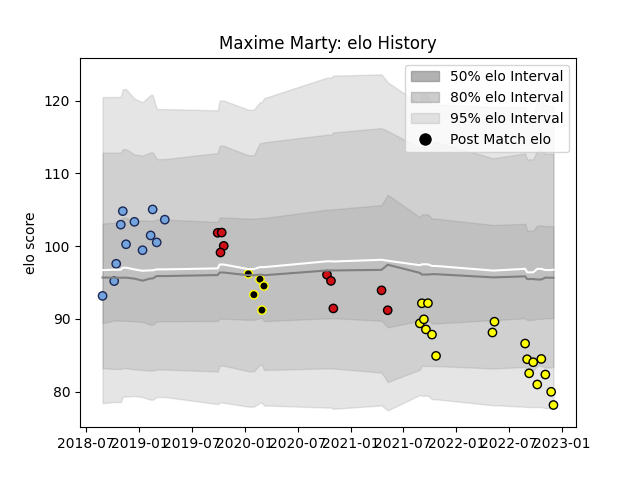

---  
layout: page  
title: Maxime Marty  
date: 2022-12-09 13:06:53.316274  
categories: player  
---
# Maxime Marty

## Positions: W

## Current elo: 78.0

## Current Percentile: 6.0

# Elo History

# Match History

| Team             |   Appearances |   Win Rate |
|:-----------------|--------------:|-----------:|
| Carcassonne      |            18 |   0.472222 |
| Bayonne          |            12 |   0.625    |
| Stade Toulousain |             9 |   0.333333 |
| Mont-de-Marsan   |             5 |   0.6      |

| Opponent             |   Matches |   Win Rate |
|:---------------------|----------:|-----------:|
| Montauban            |         4 |   0.75     |
| Beziers              |         4 |   0.5      |
| Aurillac             |         4 |   0.75     |
| Vannes               |         3 |   0.166667 |
| Carcassonne          |         2 |   0.5      |
| Castres Olympique    |         2 |   0.5      |
| Colomiers            |         2 |   0.5      |
| US Bressane          |         2 |   1        |
| Mont-de-Marsan       |         2 |   0.25     |
| Rouen                |         2 |   1        |
| Provence Rugby       |         2 |   0        |
| Biarritz Olympique   |         1 |   0        |
| Pau                  |         1 |   1        |
| Toulon               |         1 |   0        |
| Stade Francais Paris |         1 |   0        |
| Soyaux-Angouleme     |         1 |   1        |
| Racing 92            |         1 |   1        |
| Nevers               |         1 |   1        |
| Oyonnax              |         1 |   0        |
| Brive                |         1 |   0        |
| Montpellier Herault  |         1 |   0        |
| Bayonne              |         1 |   1        |
| Massy                |         1 |   0        |
| Lyon                 |         1 |   0        |
| Grenoble             |         1 |   0        |
| Agen                 |         1 |   1        |