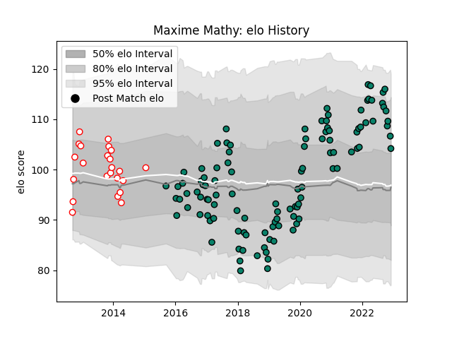

---  
layout: page  
title: Maxime Mathy  
date: 2023-02-02 18:48:41.616500  
categories: player  
---
# Maxime Mathy

## Positions: C

## Current elo: 119.0

## Current Percentile: 91.0

# Elo History

# Match History

| Team      |   Appearances |   Win Rate |
|:----------|--------------:|-----------:|
| Montauban |           151 |   0.486755 |
| Dax       |            36 |   0.444444 |

| Opponent                   |   Matches |   Win Rate |
|:---------------------------|----------:|-----------:|
| Biarritz Olympique         |        13 |   0.384615 |
| Beziers                    |        12 |   0.375    |
| Colomiers                  |        11 |   0.454545 |
| Narbonne                   |        10 |   0.6      |
| Vannes                     |         9 |   0.5      |
| Carcassonne                |         9 |   0.444444 |
| Aurillac                   |         9 |   0.5      |
| Oyonnax                    |         8 |   0.5625   |
| Mont-de-Marsan             |         8 |   0.375    |
| Soyaux-Angouleme           |         7 |   0.714286 |
| Grenoble                   |         7 |   0.571429 |
| Provence Rugby             |         7 |   0.428571 |
| Bayonne                    |         7 |   0.142857 |
| Nevers                     |         7 |   0.714286 |
| Agen                       |         6 |   0.333333 |
| Bourgoin-Jallieu           |         6 |   0.416667 |
| Albi                       |         6 |   0.666667 |
| Perpignan                  |         6 |   0.333333 |
| US Bressane                |         5 |   0.5      |
| Massy                      |         5 |   0.6      |
| Tarbes                     |         4 |   0.5      |
| Lyon                       |         4 |   0        |
| Dax                        |         4 |   0.75     |
| Rouen                      |         4 |   0.5      |
| Pau                        |         3 |   0.333333 |
| Roval Drome XV             |         2 |   1        |
| Auch                       |         2 |   0.75     |
| La Rochelle                |         2 |   0.5      |
| Périgueux                  |         1 |   1        |
| Montauban                  |         1 |   0        |
| Valence Romans Drome Rugby |         1 |   0        |
| Brive                      |         1 |   1        |