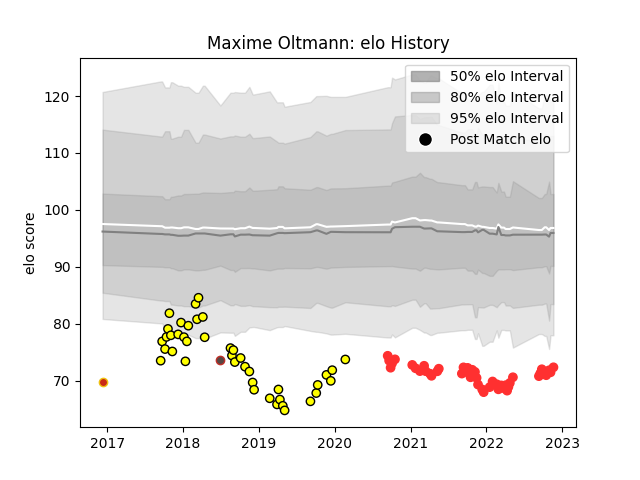

---  
layout: page  
title: Maxime Oltmann  
date: 2023-03-17 17:21:15.143550  
categories: player  
---
# Maxime Oltmann

## Positions: W, FB

## Country: Germany

## Current elo: 61.0

## Current Percentile: 3.0

# Elo History

# Match History

| Team        |   Appearances |   Win Rate |
|:------------|--------------:|-----------:|
| Tarbes      |            64 |   0.515625 |
| Carcassonne |            45 |   0.366667 |
| Germany     |             3 |   0.5      |
| Perpignan   |             1 |   0        |

| Opponent                   |   Matches |   Win Rate |
|:---------------------------|----------:|-----------:|
| Dax                        |         7 |   0.571429 |
| Nice                       |         6 |   0.416667 |
| Bourgoin-Jallieu           |         6 |   0.666667 |
| Narbonne                   |         6 |   0.5      |
| Cognac Saint Jean d'Angély |         6 |   0.916667 |
| Soyaux-Angouleme           |         5 |   0.7      |
| Blagnac                    |         5 |   0.3      |
| Nevers                     |         5 |   0.4      |
| Massy                      |         5 |   0.2      |
| Albi                       |         4 |   0.75     |
| US Bressane                |         4 |   0.5      |
| Suresnes                   |         4 |   0.25     |
| Montauban                  |         4 |   0.25     |
| Mont-de-Marsan             |         4 |   0        |
| Aurillac                   |         4 |   0.5      |
| Chambery                   |         4 |   0.5      |
| Dijon                      |         3 |   0.5      |
| Biarritz Olympique         |         3 |   0.333333 |
| Beziers                    |         3 |   0        |
| Oyonnax                    |         3 |   0        |
| Vannes                     |         3 |   0.333333 |
| Aubenas                    |         3 |   0.666667 |
| Carqueiranne-Hyères        |         2 |   0.5      |
| Provence Rugby             |         2 |   0.5      |
| Colomiers                  |         2 |   0.5      |
| Valence Romans Drome Rugby |         2 |   0.5      |
| Brive                      |         1 |   0        |
| Perpignan                  |         1 |   0        |
| Grenoble                   |         1 |   0        |
| Rennes                     |         1 |   1        |
| Samoa                      |         1 |   0        |
| Spain                      |         1 |   0.5      |
| Bayonne                    |         1 |   1        |
| Portugal                   |         1 |   1        |