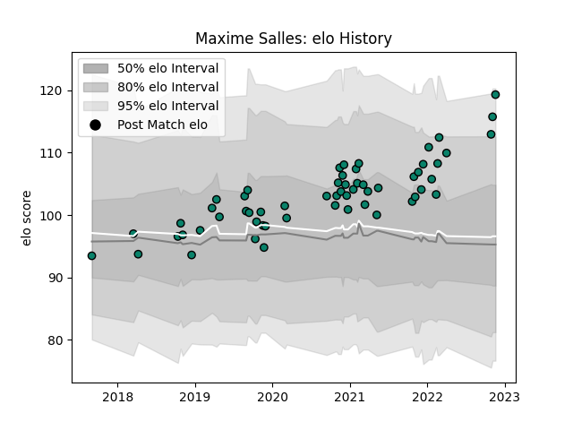

---  
layout: page  
title: Maxime Salles  
date: 2022-12-18 16:14:11.280459  
categories: player  
---
# Maxime Salles

## Positions: FB, W

## Current elo: 123.0

## Current Percentile: 95.0

# Elo History

# Match History

| Team      |   Appearances |   Win Rate |
|:----------|--------------:|-----------:|
| Montauban |            61 |   0.532787 |

| Opponent                   |   Matches |   Win Rate |
|:---------------------------|----------:|-----------:|
| Vannes                     |         5 |   0.3      |
| Nevers                     |         5 |   0.6      |
| Carcassonne                |         4 |   0.25     |
| Soyaux-Angouleme           |         4 |   0.875    |
| Provence Rugby             |         4 |   0.25     |
| Oyonnax                    |         4 |   0.5      |
| Mont-de-Marsan             |         4 |   0.75     |
| Colomiers                  |         3 |   1        |
| Grenoble                   |         3 |   0.5      |
| Perpignan                  |         3 |   0.333333 |
| Beziers                    |         3 |   0.166667 |
| Rouen                      |         3 |   0.666667 |
| US Bressane                |         3 |   0.5      |
| Massy                      |         2 |   1        |
| Biarritz Olympique         |         2 |   1        |
| Bayonne                    |         2 |   0        |
| Agen                       |         2 |   0.5      |
| Dax                        |         1 |   1        |
| Aurillac                   |         1 |   1        |
| Brive                      |         1 |   0        |
| Roval Drome XV             |         1 |   1        |
| Valence Romans Drome Rugby |         1 |   0        |