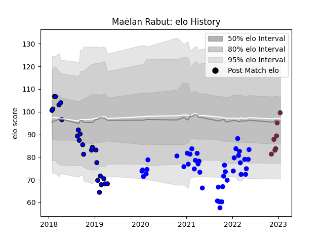

---  
layout: page  
title: Maëlan Rabut  
date: 2022-11-15 23:39:54.422404  
categories: player  
---
# Maëlan Rabut

## Positions: C, FB

## Current elo: 87.0

## Current Percentile: 21.0

# Elo History

# Match History

| Team   |   Appearances |   Win Rate |
|:-------|--------------:|-----------:|
| Vannes |            35 |   0.542857 |
| Massy  |            16 |   0        |
| Toulon |             1 |   0        |

| Opponent                   |   Matches |   Win Rate |
|:---------------------------|----------:|-----------:|
| Mont-de-Marsan             |         6 |       0.5  |
| Montauban                  |         4 |       0.5  |
| Provence Rugby             |         4 |       0.5  |
| Carcassonne                |         4 |       0.5  |
| Colomiers                  |         4 |       0.25 |
| Aurillac                   |         4 |       0.5  |
| Oyonnax                    |         4 |       0    |
| Beziers                    |         3 |       0    |
| Bayonne                    |         2 |       0    |
| Biarritz Olympique         |         2 |       0    |
| US Bressane                |         2 |       0.5  |
| Grenoble                   |         2 |       0.5  |
| Nevers                     |         2 |       0.5  |
| Valence Romans Drome Rugby |         1 |       0    |
| Roval Drome XV             |         1 |       1    |
| Rouen                      |         1 |       1    |
| Agen                       |         1 |       1    |
| Narbonne                   |         1 |       1    |
| Montpellier Herault        |         1 |       0    |
| Dax                        |         1 |       0    |
| Brive                      |         1 |       0    |
| Vannes                     |         1 |       0    |