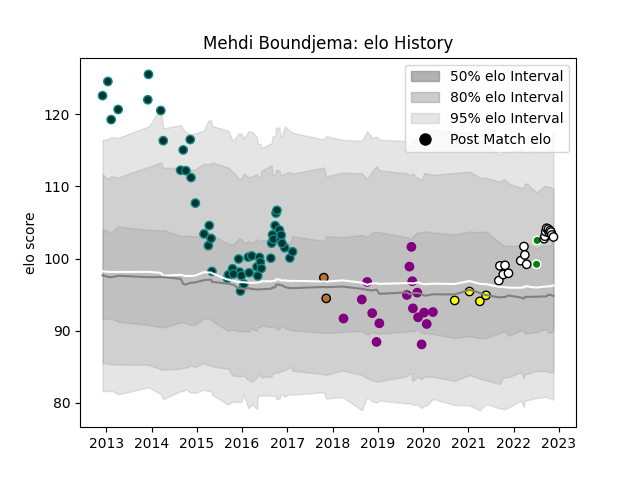

---  
layout: page  
title: Mehdi Boundjema  
date: 2022-12-18 16:11:46.485884  
categories: player  
---
# Mehdi Boundjema

## Positions: H

## Country: Algeria

## Current elo: 104.0

## Current Percentile: 77.0

# Elo History

# Match History

| Team                       |   Appearances |   Win Rate |
|:---------------------------|--------------:|-----------:|
| Pau                        |            50 |   0.45     |
| Valence Romans Drome Rugby |            22 |   0.704545 |
| Soyaux-Angouleme           |            17 |   0.264706 |
| Albi                       |             4 |   0.625    |
| Algeria                    |             3 |   0.666667 |
| Narbonne                   |             2 |   0        |

| Opponent                   |   Matches |   Win Rate |
|:---------------------------|----------:|-----------:|
| Bourgoin-Jallieu           |         5 |   0.7      |
| Carcassonne                |         5 |   0.3      |
| Grenoble                   |         4 |   0.5      |
| Perpignan                  |         4 |   0        |
| Brive                      |         4 |   0        |
| Nevers                     |         3 |   0.5      |
| Racing 92                  |         3 |   0.5      |
| Massy                      |         3 |   0.5      |
| Castres Olympique          |         3 |   0.333333 |
| Nice                       |         3 |   0.833333 |
| Aurillac                   |         3 |   0.333333 |
| Biarritz Olympique         |         3 |   0.666667 |
| Tarbes                     |         3 |   0.666667 |
| Bordeaux Begles            |         2 |   0        |
| Dax                        |         2 |   0        |
| Lyon                       |         2 |   0.5      |
| La Rochelle                |         2 |   0.5      |
| Albi                       |         2 |   0.5      |
| Dragons                    |         2 |   0        |
| Blagnac                    |         2 |   1        |
| Colomiers                  |         2 |   0.5      |
| US Bressane                |         2 |   0        |
| Cognac Saint Jean d'Angély |         2 |   1        |
| Clermont Auvergne          |         2 |   0        |
| Aubenas                    |         2 |   1        |
| Stade Toulousain           |         2 |   0.5      |
| Beziers                    |         2 |   0.5      |
| Suresnes                   |         2 |   1        |
| Montpellier Herault        |         2 |   0.5      |
| Provence Rugby             |         1 |   1        |
| Senegal                    |         1 |   1        |
| Rennes                     |         1 |   1        |
| Sale Sharks                |         1 |   0        |
| Toulon                     |         1 |   0        |
| Soyaux-Angouleme           |         1 |   1        |
| Agen                       |         1 |   0        |
| Oyonnax                    |         1 |   0        |
| Narbonne                   |         1 |   1        |
| Montauban                  |         1 |   1        |
| Mont-de-Marsan             |         1 |   1        |
| Kenya                      |         1 |   0        |
| Dijon                      |         1 |   1        |
| Chambery                   |         1 |   0        |
| Carqueiranne-Hyères        |         1 |   1        |
| Bristol Rugby              |         1 |   0        |
| Bayonne                    |         1 |   1        |
| Bath Rugby                 |         1 |   0        |
| Auch                       |         1 |   1        |
| Zimbabwe                   |         1 |   1        |