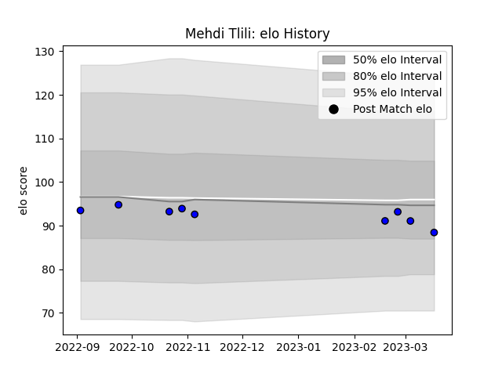

---  
layout: page  
title: Mehdi Tlili  
date: 2023-03-21 18:24:20.636955  
categories: player  
---
# Mehdi Tlili

Last updated: 2023-03-21
## Positions: FL

## Current elo: 88.0

## Current Percentile: 37.0

# Elo History

# Match History

| Team   |   Appearances |   Win Rate |
|:-------|--------------:|-----------:|
| Massy  |             9 |   0.222222 |

| Opponent           |   Matches |   Win Rate |
|:-------------------|----------:|-----------:|
| Agen               |         1 |          0 |
| Aurillac           |         1 |          0 |
| Biarritz Olympique |         1 |          0 |
| Mont-de-Marsan     |         1 |          1 |
| Montauban          |         1 |          0 |
| Oyonnax            |         1 |          0 |
| Provence Rugby     |         1 |          1 |
| Rouen              |         1 |          0 |
| Vannes             |         1 |          0 |