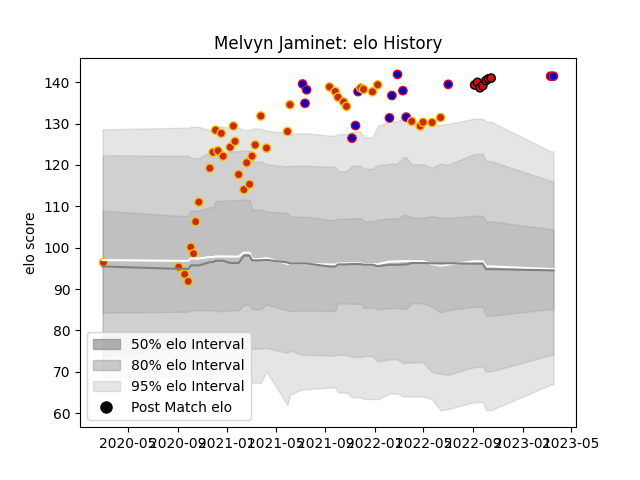

---  
layout: page  
title: Melvyn Jaminet  
date: 2023-03-17 17:28:56.865384  
categories: player  
---
# Melvyn Jaminet

## Positions: FB

## Country: France

## Current elo: 141.0

## Current Percentile: None

# Elo History

# Match History

| Team             |   Appearances |   Win Rate |
|:-----------------|--------------:|-----------:|
| Perpignan        |            41 |   0.731707 |
| France           |            13 |   0.846154 |
| Stade Toulousain |             7 |   0.857143 |

| Opponent                   |   Matches |   Win Rate |
|:---------------------------|----------:|-----------:|
| Biarritz Olympique         |         5 |   0.8      |
| Mont-de-Marsan             |         3 |   1        |
| Australia                  |         3 |   0.333333 |
| Oyonnax                    |         3 |   1        |
| Montpellier Herault        |         3 |   0.333333 |
| Provence Rugby             |         2 |   1        |
| Rouen                      |         2 |   1        |
| Montauban                  |         2 |   0.5      |
| Soyaux-Angouleme           |         2 |   1        |
| Toulon                     |         2 |   1        |
| Valence Romans Drome Rugby |         2 |   1        |
| Grenoble                   |         2 |   1        |
| England                    |         2 |   1        |
| Colomiers                  |         2 |   0.5      |
| Clermont Auvergne          |         2 |   1        |
| Castres Olympique          |         2 |   0        |
| Carcassonne                |         2 |   1        |
| Brive                      |         2 |   1        |
| Bordeaux Begles            |         2 |   0.5      |
| Pau                        |         2 |   0        |
| Vannes                     |         1 |   1        |
| Stade Francais Paris       |         1 |   0        |
| Scotland                   |         1 |   1        |
| Racing 92                  |         1 |   1        |
| Argentina                  |         1 |   1        |
| New Zealand                |         1 |   1        |
| Nevers                     |         1 |   1        |
| Aurillac                   |         1 |   1        |
| La Rochelle                |         1 |   0        |
| Japan                      |         1 |   1        |
| Italy                      |         1 |   1        |
| Ireland                    |         1 |   1        |
| Georgia                    |         1 |   1        |
| Wales                      |         1 |   1        |