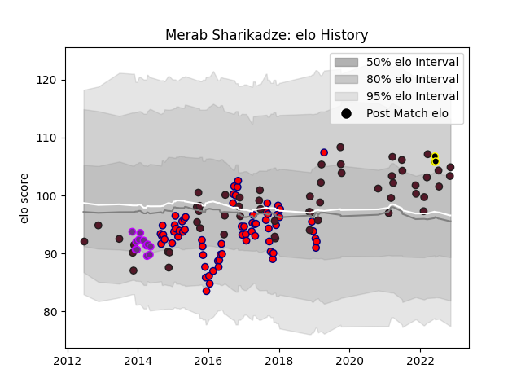

---  
layout: page  
title: Merab Sharikadze  
date: 2022-11-16 11:32:45.774199  
categories: player  
---
# Merab Sharikadze

## Positions: C

## Country: Georgia

## Current elo: 105.0

## Current Percentile: 75.0

# Elo History

# Match History

| Team        |   Appearances |   Win Rate |
|:------------|--------------:|-----------:|
| Aurillac    |            70 |   0.5      |
| Georgia     |            56 |   0.580357 |
| US Bressane |            12 |   0.375    |
| Black Lion  |             3 |   0.666667 |

| Opponent                 |   Matches |   Win Rate |
|:-------------------------|----------:|-----------:|
| Carcassonne              |         8 |   0.625    |
| Bourgoin-Jallieu         |         6 |   0.75     |
| Agen                     |         5 |   0.2      |
| Samoa                    |         5 |   0.7      |
| Narbonne                 |         5 |   1        |
| Montauban                |         5 |   0.5      |
| Dax                      |         5 |   0.4      |
| Colomiers                |         5 |   0.2      |
| Mont-de-Marsan           |         5 |   0.3      |
| Beziers                  |         5 |   0.4      |
| Tonga                    |         4 |   0.75     |
| Canada                   |         4 |   0.75     |
| Biarritz Olympique       |         4 |   0.5      |
| Albi                     |         4 |   0.5      |
| United States of America |         4 |   0.5      |
| Japan                    |         4 |   0.25     |
| Italy                    |         3 |   0.333333 |
| Soyaux-Angouleme         |         3 |   0.666667 |
| Romania                  |         3 |   1        |
| Russia                   |         3 |   1        |
| Argentina                |         3 |   0        |
| Perpignan                |         3 |   0.666667 |
| Fiji                     |         3 |   0.5      |
| Portugal                 |         3 |   0.833333 |
| Vannes                   |         3 |   0.333333 |
| Pau                      |         2 |   0.5      |
| Oyonnax                  |         2 |   0        |
| Netherlands              |         2 |   1        |
| Nevers                   |         2 |   0.5      |
| Scotland                 |         2 |   0        |
| Spain                    |         2 |   1        |
| Tarbes                   |         2 |   0        |
| Uruguay                  |         2 |   1        |
| Bayonne                  |         2 |   0        |
| Lyon                     |         2 |   0.5      |
| South Africa             |         1 |   0        |
| SWD Eagles               |         1 |   1        |
| Boland Cavaliers         |         1 |   0        |
| Provence Rugby           |         1 |   1        |
| New Zealand              |         1 |   0        |
| Auch                     |         1 |   1        |
| Namibia                  |         1 |   1        |
| Australia                |         1 |   0        |
| Massy                    |         1 |   0        |
| Leopards                 |         1 |   1        |
| Ireland                  |         1 |   0        |
| Grenoble                 |         1 |   1        |
| Germany                  |         1 |   1        |
| France                   |         1 |   0        |
| Belgium                  |         1 |   1        |
| Wales                    |         1 |   0        |