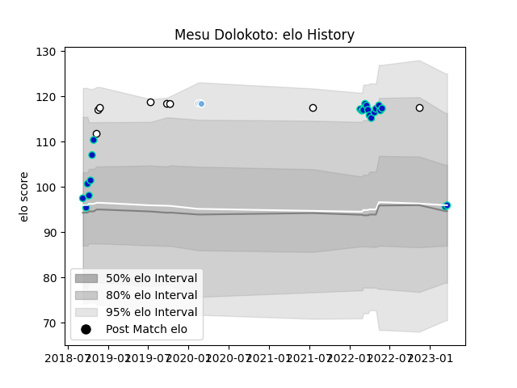

---  
layout: page  
title: Mesu Dolokoto  
date: 2023-03-21 18:05:28.383713  
categories: player  
---
# Mesu Dolokoto

Last updated: 2023-03-21
## Positions: H, FL

## Country: Fiji

## Current elo: 96.0

## Current Percentile: 89.0

# Elo History

# Match History

| Team             |   Appearances |   Win Rate |
|:-----------------|--------------:|-----------:|
| Fijian Drua      |            22 |   0.454545 |
| Fiji             |             8 |   0.375    |
| Glasgow Warriors |             3 |   0.666667 |

| Opponent                 |   Matches |   Win Rate |
|:-------------------------|----------:|-----------:|
| Brumbies                 |         2 |        0   |
| Canberra Vikings         |         2 |        1   |
| Western Force            |         2 |        0.5 |
| Crusaders                |         2 |        0.5 |
| Uruguay                  |         2 |        0.5 |
| Queensland Reds          |         2 |        0   |
| Melbourne Rebels         |         2 |        0.5 |
| New South Wales Waratahs |         2 |        0   |
| Blues                    |         1 |        0   |
| New Zealand              |         1 |        0   |
| Wales                    |         1 |        0   |
| Sydney Rays              |         1 |        1   |
| Scotland                 |         1 |        0   |
| Queensland Country       |         1 |        1   |
| New Zealand Maori        |         1 |        1   |
| Moana Pasifika           |         1 |        1   |
| NSW Country Eagles       |         1 |        1   |
| Brisbane City            |         1 |        1   |
| Leinster                 |         1 |        0   |
| Ireland                  |         1 |        0   |
| Highlanders              |         1 |        0   |
| France                   |         1 |        1   |
| Dragons                  |         1 |        1   |
| Chiefs                   |         1 |        0   |
| Zebre                    |         1 |        1   |