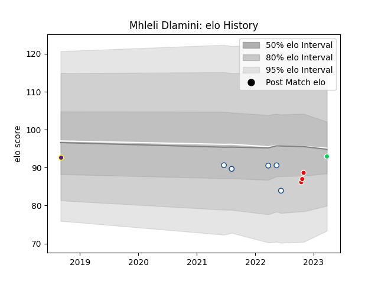

---  
layout: page  
title: Mhleli Dlamini  
date: 2023-03-27 11:35:41.192351  
categories: player  
---
# Mhleli Dlamini

Last updated: 2023-03-27
## Positions: P

## Current elo: 93.0

## Current Percentile: 14.0

# Elo History

# Match History

| Team          |   Appearances |   Win Rate |
|:--------------|--------------:|-----------:|
| Blue Bulls    |             5 |        0.4 |
| Tel-Aviv Heat |             3 |        1   |
| Griffons      |             1 |        0   |
| SWD Eagles    |             1 |        1   |

| Opponent               |   Matches |   Win Rate |
|:-----------------------|----------:|-----------:|
| Golden Lions           |         2 |          1 |
| Black Lion             |         1 |          1 |
| Eastern Province Kings |         1 |          1 |
| Free State Cheetahs    |         1 |          0 |
| Natal Sharks           |         1 |          0 |
| RC Batumi              |         1 |          1 |
| Romanian Wolves        |         1 |          1 |
| Valke                  |         1 |          0 |
| Western Province       |         1 |          0 |