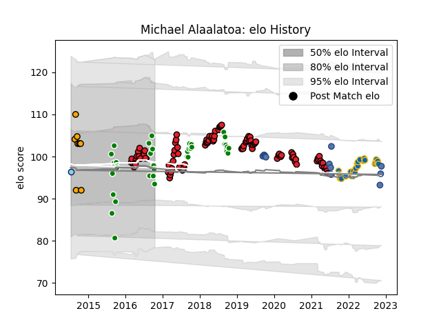

---  
layout: page  
title: Michael Alaalatoa  
date: 2023-03-30 11:30:55.008829  
categories: player  
---
# Michael Alaalatoa

Last updated: 2023-03-30
## Positions: P

## Country: Samoa

## Current elo: 93.0

## Current Percentile: 44.0

# Elo History

# Match History

| Team                     |   Appearances |   Win Rate |
|:-------------------------|--------------:|-----------:|
| Crusaders                |            96 |   0.854167 |
| Manawatu                 |            36 |   0.333333 |
| Leinster                 |            29 |   0.827586 |
| Samoa                    |            13 |   0.461538 |
| NSW Country Eagles       |             9 |   0.666667 |
| New South Wales Waratahs |             1 |   1        |

| Opponent                 |   Matches |   Win Rate |
|:-------------------------|----------:|-----------:|
| Chiefs                   |        13 |   0.692308 |
| Hurricanes               |        13 |   0.692308 |
| Highlanders              |        13 |   0.769231 |
| Blues                    |        11 |   1        |
| Lions                    |         7 |   0.857143 |
| Queensland Reds          |         6 |   1        |
| Melbourne Rebels         |         5 |   1        |
| Bulls                    |         5 |   0.8      |
| Brumbies                 |         5 |   1        |
| New South Wales Waratahs |         5 |   1        |
| Sharks                   |         5 |   0.7      |
| Northland                |         4 |   0.75     |
| Taranaki                 |         4 |   0        |
| Southland                |         3 |   0.666667 |
| Otago                    |         3 |   0        |
| Hawke's Bay              |         3 |   0        |
| Jaguares                 |         3 |   1        |
| Connacht                 |         3 |   1        |
| Stormers                 |         3 |   0.833333 |
| Tasman                   |         3 |   0.333333 |
| Canterbury               |         3 |   0.333333 |
| Tonga                    |         3 |   1        |
| Ulster                   |         3 |   0.666667 |
| Waikato                  |         3 |   0.333333 |
| Wellington               |         3 |   0.666667 |
| Bay of Plenty            |         3 |   0.333333 |
| Western Force            |         3 |   1        |
| Munster                  |         3 |   1        |
| Sunwolves                |         2 |   1        |
| New Zealand Maori        |         2 |   0        |
| Zebre                    |         2 |   1        |
| Counties Manukau         |         2 |   0        |
| Benetton Treviso         |         2 |   1        |
| Brisbane City            |         2 |   0        |
| Glasgow Warriors         |         2 |   1        |
| La Rochelle              |         1 |   0        |
| Georgia                  |         1 |   1        |
| Southern Kings           |         1 |   1        |
| Edinburgh                |         1 |   1        |
| Dragons                  |         1 |   1        |
| Cheetahs                 |         1 |   1        |
| Sydney Stars             |         1 |   1        |
| Scarlets                 |         1 |   1        |
| Cardiff Blues            |         1 |   0        |
| Canberra Vikings         |         1 |   1        |
| British and Irish Lions  |         1 |   0        |
| Bath Rugby               |         1 |   1        |
| Scotland                 |         1 |   0        |
| Russia                   |         1 |   1        |
| Australia                |         1 |   0        |
| Romania                  |         1 |   1        |
| Racing 92                |         1 |   1        |
| Queensland Country       |         1 |   1        |
| Perth Spirit             |         1 |   1        |
| Gloucester Rugby         |         1 |   1        |
| Ospreys                  |         1 |   1        |
| Greater Sydney Rams      |         1 |   1        |
| North Harbour Rays       |         1 |   1        |
| North Harbour            |         1 |   1        |
| Ireland                  |         1 |   0        |
| Italy                    |         1 |   0        |
| Japan                    |         1 |   0        |
| Melbourne Rising         |         1 |   0        |
| Auckland                 |         1 |   0        |