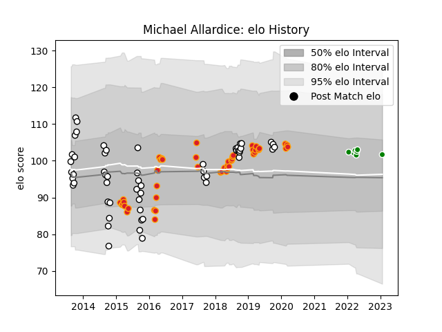

---  
layout: page  
title: Michael Allardice  
date: 2023-01-25 18:59:12.397439  
categories: player  
---
# Michael Allardice

## Positions: L

## Country: Chiefs

## Current elo: 102.0

## Current Percentile: 68.0

# Elo History

# Match History

| Team            |   Appearances |   Win Rate |
|:----------------|--------------:|-----------:|
| Hawke's Bay     |            55 |   0.581818 |
| Chiefs          |            45 |   0.555556 |
| Toyota Verblitz |             7 |   0.428571 |

| Opponent                        |   Matches |   Win Rate |
|:--------------------------------|----------:|-----------:|
| Hurricanes                      |         9 |   0.388889 |
| Otago                           |         7 |   0.857143 |
| Bay of Plenty                   |         7 |   0.571429 |
| Southland                       |         5 |   0.9      |
| Northland                       |         5 |   0.8      |
| North Harbour                   |         5 |   0.4      |
| Highlanders                     |         5 |   0.3      |
| New South Wales Waratahs        |         4 |   0.75     |
| Manawatu                        |         4 |   0.5      |
| Brumbies                        |         4 |   0.5      |
| Tasman                          |         4 |   0        |
| Wellington                      |         4 |   0.875    |
| Counties Manukau                |         4 |   0.75     |
| Taranaki                        |         3 |   0.333333 |
| Jaguares                        |         3 |   0.666667 |
| Waikato                         |         3 |   0.333333 |
| Canterbury                      |         3 |   0        |
| Blues                           |         3 |   1        |
| Toshiba Brave Lupus Tokyo       |         2 |   0        |
| Melbourne Rebels                |         2 |   0.5      |
| Sunwolves                       |         2 |   0.5      |
| Crusaders                       |         2 |   0.5      |
| Sharks                          |         2 |   0        |
| Bulls                           |         2 |   1        |
| Stormers                        |         2 |   1        |
| Tokyo Sungoliath                |         1 |   0        |
| Western Force                   |         1 |   1        |
| Auckland                        |         1 |   1        |
| Southern Kings                  |         1 |   1        |
| Shizuoka Blue Revs              |         1 |   1        |
| NTT Docomo Red Hurricanes Osaka |         1 |   1        |
| Lions                           |         1 |   0        |
| Green Rockets Tokatsu           |         1 |   1        |
| Cheetahs                        |         1 |   1        |
| British and Irish Lions         |         1 |   0        |
| Yokohama Canon Eagles           |         1 |   0        |