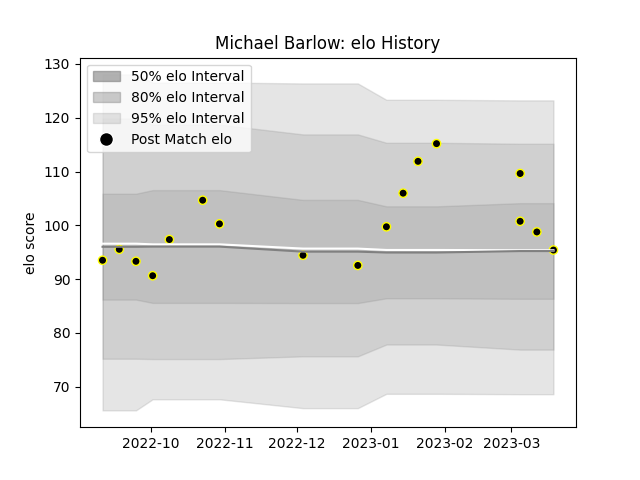

---  
layout: page  
title: Michael Barlow  
date: 2023-03-21 18:21:57.289644  
categories: player  
---
# Michael Barlow

Last updated: 2023-03-21
## Positions: C

## Current elo: 95.0

## Current Percentile: 81.0

# Elo History

# Match History

| Team   |   Appearances |   Win Rate |
|:-------|--------------:|-----------:|
| Caldy  |            17 |   0.294118 |

| Opponent            |   Matches |   Win Rate |
|:--------------------|----------:|-----------:|
| Jersey              |         3 |        0   |
| Ampthill            |         2 |        0   |
| Bedford             |         2 |        0.5 |
| Coventry            |         2 |        0   |
| Nottingham          |         2 |        0.5 |
| Richmond            |         2 |        1   |
| Doncaster           |         1 |        0   |
| Ealing Trailfinders |         1 |        1   |
| Hartpury College    |         1 |        0   |
| London Scottish     |         1 |        0   |