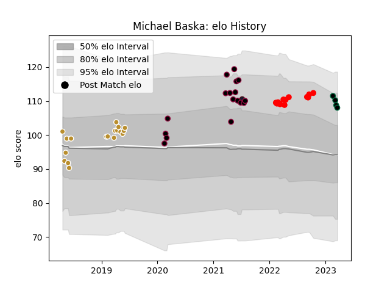

---  
layout: page  
title: Michael Baska  
date: 2023-03-21 18:50:38.608661  
categories: player  
---
# Michael Baska

Last updated: 2023-03-21
## Positions: SH, FB

## Country: United States of America

## Current elo: 108.0

## Current Percentile: 82.0

# Elo History

# Match History

| Team                     |   Appearances |   Win Rate |
|:-------------------------|--------------:|-----------:|
| NOLA Gold                |            18 |   0.5      |
| Utah Warriors            |            17 |   0.676471 |
| Rouen                    |            13 |   0.538462 |
| Chicago Hounds           |             4 |   0.25     |
| United States of America |             1 |   0        |

| Opponent               |   Matches |   Win Rate |
|:-----------------------|----------:|-----------:|
| Seattle Seawolves      |         6 |   0.5      |
| Houston SaberCats      |         5 |   0.8      |
| Glendale Raptors       |         3 |   0.333333 |
| Austin Elite Rugby     |         3 |   0.666667 |
| Utah Warriors          |         3 |   0.666667 |
| Toronto Arrows         |         3 |   0.666667 |
| San Diego Legion       |         3 |   0.333333 |
| L. A. Giltinis         |         3 |   0.333333 |
| Mont-de-Marsan         |         2 |   0.5      |
| Old Glory DC           |         2 |   0.5      |
| Vannes                 |         2 |   1        |
| Austin Herd            |         2 |   0.75     |
| Grenoble               |         1 |   0        |
| Oyonnax                |         1 |   0        |
| Austin Gilgronis       |         1 |   1        |
| Beziers                |         1 |   1        |
| Colomiers              |         1 |   1        |
| R.U. New York          |         1 |   0        |
| Provence Rugby         |         1 |   1        |
| Colorado Raptors       |         1 |   0        |
| England                |         1 |   0        |
| New England Free Jacks |         1 |   1        |
| Narbonne               |         1 |   0        |
| NOLA Gold              |         1 |   0        |
| Montauban              |         1 |   0        |
| Aurillac               |         1 |   1        |
| Dallas Jackals         |         1 |   1        |
| Agen                   |         1 |   0        |