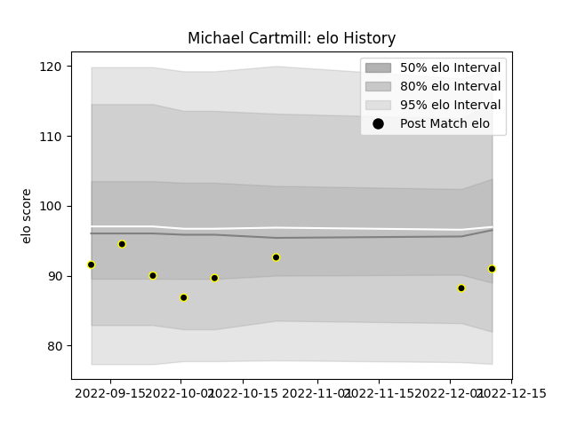

---  
layout: page  
title: Michael Cartmill  
date: 2023-03-21 18:37:49.388137  
categories: player  
---
# Michael Cartmill

Last updated: 2023-03-21
## Positions: C, W

## Current elo: 77.0

## Current Percentile: 33.0

# Elo History

# Match History

| Team   |   Appearances |   Win Rate |
|:-------|--------------:|-----------:|
| Caldy  |            16 |     0.3125 |

| Opponent         |   Matches |   Win Rate |
|:-----------------|----------:|-----------:|
| Jersey           |         3 |        0   |
| Ampthill         |         2 |        0   |
| Bedford          |         2 |        0.5 |
| Nottingham       |         2 |        0.5 |
| Richmond         |         2 |        1   |
| Cornish Pirates  |         1 |        1   |
| Coventry         |         1 |        0   |
| Doncaster        |         1 |        0   |
| Hartpury College |         1 |        0   |
| London Scottish  |         1 |        0   |