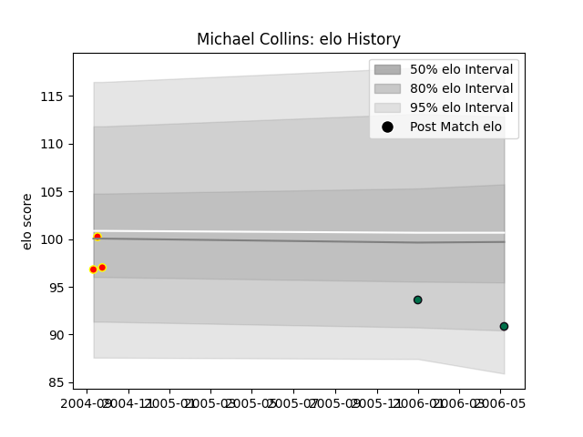

---  
layout: page  
title: Michael Collins  
date: 2023-02-02 18:39:52.174188  
categories: player  
---
# Michael Collins

## Positions: P

## Current elo: 102.0

## Current Percentile: 62.0

# Elo History

# Match History

| Team         |   Appearances |   Win Rate |
|:-------------|--------------:|-----------:|
| London Irish |            21 |   0.571429 |
| Waikato      |             5 |   0.6      |

| Opponent           |   Matches |   Win Rate |
|:-------------------|----------:|-----------:|
| Bristol Rugby      |         3 |   1        |
| Wasps              |         3 |   0.666667 |
| Newcastle Falcons  |         2 |   0.5      |
| Northampton Saints |         2 |   0.5      |
| Saracens           |         2 |   0.5      |
| Worcester Warriors |         2 |   0.5      |
| Gloucester Rugby   |         2 |   0.5      |
| Leeds              |         1 |   1        |
| Leicester Tigers   |         1 |   0        |
| Bath Rugby         |         1 |   1        |
| Harlequins         |         1 |   0        |
| Northland          |         1 |   1        |
| Otago              |         1 |   1        |
| Sale Sharks        |         1 |   0        |
| Canterbury         |         1 |   0        |
| Wellington         |         1 |   0        |
| Auckland           |         1 |   1        |