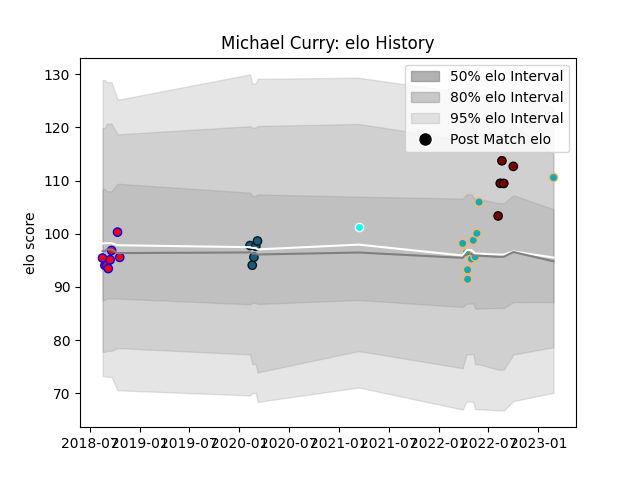

---  
layout: page  
title: Michael Curry  
date: 2023-03-02 11:22:57.000989  
categories: player  
---
# Michael Curry

## Positions: L, FL

## Current elo: 111.0

## Current Percentile: 84.0

# Elo History

# Match History

| Team                             |   Appearances |   Win Rate |
|:---------------------------------|--------------:|-----------:|
| Moana Pasifika                   |            10 |       0.1  |
| Tasman                           |             8 |       0.75 |
| Colorado Raptors                 |             5 |       0.4  |
| North Harbour                    |             5 |       0.6  |
| Toyota Industries Shuttles Aichi |             1 |       1    |

| Opponent                 |   Matches |   Win Rate |
|:-------------------------|----------:|-----------:|
| Auckland                 |         2 |        0   |
| Canterbury               |         2 |        0.5 |
| Chiefs                   |         2 |        0   |
| Fijian Drua              |         2 |        0   |
| Hawke's Bay              |         2 |        0.5 |
| Manawatu                 |         2 |        1   |
| Southland                |         2 |        1   |
| Queensland Reds          |         1 |        0   |
| Toronto Arrows           |         1 |        1   |
| Tasman                   |         1 |        1   |
| Taranaki                 |         1 |        1   |
| Skyactivs Hiroshima      |         1 |        1   |
| San Diego Legion         |         1 |        0   |
| NOLA Gold                |         1 |        0   |
| North Harbour            |         1 |        1   |
| New South Wales Waratahs |         1 |        0   |
| Blues                    |         1 |        0   |
| Melbourne Rebels         |         1 |        0   |
| Hurricanes               |         1 |        0   |
| Houston SaberCats        |         1 |        0   |
| Brumbies                 |         1 |        1   |
| Utah Warriors            |         1 |        1   |