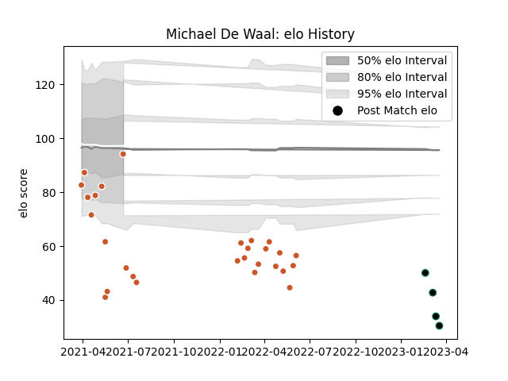

---  
layout: page  
title: Michael De Waal  
date: 2023-03-09 10:10:11.760775  
categories: player  
---
# Michael De Waal

## Positions: N8, FL

## Current elo: 94.0

## Current Percentile: 0.0

# Elo History

# Match History

| Team             |   Appearances |   Win Rate |
|:-----------------|--------------:|-----------:|
| Austin Gilgronis |            28 |   0.678571 |
| Chicago Hounds   |             2 |   0        |

| Opponent               |   Matches |   Win Rate |
|:-----------------------|----------:|-----------:|
| L. A. Giltinis         |         4 |   0.25     |
| San Diego Legion       |         4 |   0.75     |
| Seattle Seawolves      |         4 |   1        |
| Houston SaberCats      |         3 |   1        |
| Old Glory DC           |         3 |   0.333333 |
| Utah Warriors          |         3 |   0.333333 |
| NOLA Gold              |         2 |   1        |
| New England Free Jacks |         2 |   0        |
| Rugby ATL              |         2 |   0.5      |
| Dallas Jackals         |         1 |   1        |
| R.U. New York          |         1 |   1        |
| Rugby New York         |         1 |   1        |