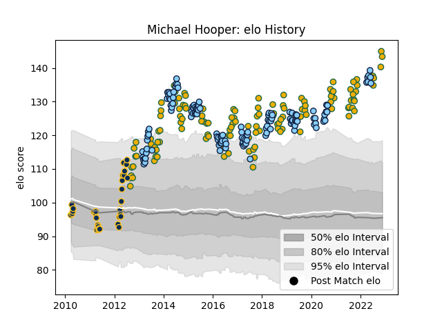

---  
layout: page  
title: Michael Hooper  
date: 2022-11-22 11:35:05.429331  
categories: player  
---
# Michael Hooper

## Positions: FL

## Country: Australia

## Current elo: 143.0

## Current Percentile: 99.0

# Elo History

# Match History

| Team                     |   Appearances |   Win Rate |
|:-------------------------|--------------:|-----------:|
| New South Wales Waratahs |           127 |   0.523622 |
| Australia                |           124 |   0.483871 |
| Brumbies                 |            31 |   0.467742 |

| Opponent                 |   Matches |   Win Rate |
|:-------------------------|----------:|-----------:|
| New Zealand              |        32 |   0.171875 |
| Argentina                |        20 |   0.875    |
| Queensland Reds          |        19 |   0.684211 |
| Melbourne Rebels         |        17 |   0.764706 |
| South Africa             |        16 |   0.5      |
| Brumbies                 |        16 |   0.375    |
| England                  |        15 |   0.2      |
| Western Force            |        14 |   0.678571 |
| Chiefs                   |        10 |   0.4      |
| Crusaders                |         9 |   0.444444 |
| France                   |         9 |   0.555556 |
| Highlanders              |         9 |   0.444444 |
| Hurricanes               |         9 |   0.444444 |
| Blues                    |         9 |   0.222222 |
| Lions                    |         8 |   0.375    |
| Scotland                 |         7 |   0.571429 |
| Ireland                  |         7 |   0.285714 |
| Sharks                   |         7 |   0.214286 |
| Wales                    |         6 |   0.666667 |
| Stormers                 |         6 |   0.666667 |
| Cheetahs                 |         6 |   0.666667 |
| Bulls                    |         5 |   0.4      |
| Sunwolves                |         4 |   0.75     |
| New South Wales Waratahs |         4 |   0.5      |
| Italy                    |         4 |   1        |
| Fiji                     |         3 |   1        |
| Jaguares                 |         3 |   0        |
| British and Irish Lions  |         2 |   0.5      |
| Southern Kings           |         2 |   0.5      |
| Japan                    |         2 |   1        |
| Uruguay                  |         1 |   1        |
| Fijian Drua              |         1 |   1        |