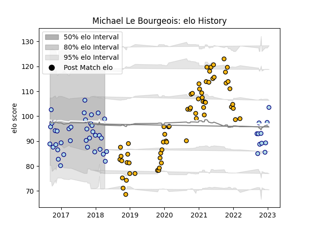

---  
layout: page  
title: Michael Le Bourgeois  
date: 2023-01-21 15:43:00.538170  
categories: player  
---
# Michael Le Bourgeois

## Positions: C

## Current elo: 99.0

## Current Percentile: 20.0

# Elo History

# Match History

| Team    |   Appearances |   Win Rate |
|:--------|--------------:|-----------:|
| Wasps   |            65 |   0.392308 |
| Bedford |            48 |   0.489583 |

| Opponent            |   Matches |   Win Rate |
|:--------------------|----------:|-----------:|
| Bristol Rugby       |         7 |   0.571429 |
| Harlequins          |         6 |   0.166667 |
| Bath Rugby          |         6 |   0.75     |
| Sale Sharks         |         6 |   0.333333 |
| Northampton Saints  |         6 |   0.166667 |
| London Scottish     |         6 |   0.75     |
| London Irish        |         6 |   0.333333 |
| Exeter Chiefs       |         6 |   0.333333 |
| Cornish Pirates     |         5 |   0.3      |
| Doncaster           |         5 |   0.3      |
| Leicester Tigers    |         4 |   0.25     |
| Jersey              |         4 |   0.5      |
| Yorkshire Carnegie  |         4 |   0.25     |
| Gloucester Rugby    |         4 |   0        |
| Ealing Trailfinders |         4 |   0        |
| Hartpury College    |         3 |   1        |
| Worcester Warriors  |         3 |   1        |
| Saracens            |         3 |   0.666667 |
| Rotherham Titans    |         3 |   1        |
| Richmond            |         3 |   0.666667 |
| Nottingham          |         3 |   0.666667 |
| Newcastle Falcons   |         3 |   0.666667 |
| Munster             |         2 |   0        |
| Bordeaux Begles     |         2 |   0        |
| Stade Toulousain    |         2 |   0        |
| Caldy               |         1 |   1        |
| London Welsh        |         1 |   1        |
| Coventry            |         1 |   0        |
| Leinster            |         1 |   0        |
| Ampthill            |         1 |   1        |
| Edinburgh           |         1 |   0        |
| Agen                |         1 |   1        |