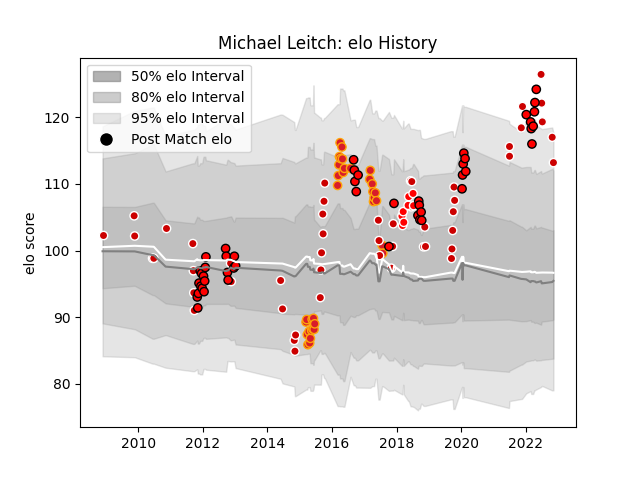

---  
layout: page  
title: Michael Leitch  
date: 2023-02-02 19:14:27.914628  
categories: player  
---
# Michael Leitch

## Positions: FL, N8

## Country: Japan

## Current elo: 127.0

## Current Percentile: 93.0

# Elo History

# Match History

| Team                      |   Appearances |   Win Rate |
|:--------------------------|--------------:|-----------:|
| Toshiba Brave Lupus Tokyo |            65 |   0.676923 |
| Japan                     |            53 |   0.54717  |
| Chiefs                    |            34 |   0.647059 |
| Sunwolves                 |             8 |   0.25     |

| Opponent                          |   Matches |   Win Rate |
|:----------------------------------|----------:|-----------:|
| Shizuoka Blue Revs                |         8 |   0.75     |
| Saitama Wild Knights              |         6 |   0.333333 |
| Black Rams Tokyo                  |         6 |   0.666667 |
| France                            |         5 |   0.1      |
| Hurricanes                        |         5 |   0.4      |
| Tokyo Sungoliath                  |         5 |   0.6      |
| Kobelco Kobe Steelers             |         4 |   0.5      |
| Queensland Reds                   |         4 |   0.75     |
| Ireland                           |         4 |   0.25     |
| Green Rockets Tokatsu             |         4 |   0.75     |
| Yokohama Canon Eagles             |         4 |   0.75     |
| Stormers                          |         4 |   0.75     |
| Toyota Verblitz                   |         4 |   0.75     |
| Sharks                            |         3 |   0.333333 |
| Scotland                          |         3 |   0.333333 |
| South Africa                      |         3 |   0.333333 |
| Samoa                             |         3 |   1        |
| Tonga                             |         3 |   0.666667 |
| Russia                            |         3 |   1        |
| United States of America          |         3 |   1        |
| Romania                           |         3 |   1        |
| Uruguay                           |         3 |   1        |
| Western Force                     |         3 |   1        |
| New Zealand                       |         3 |   0        |
| NTT Docomo Red Hurricanes Osaka   |         3 |   1        |
| Munakata Sanix Blues              |         3 |   0.666667 |
| Mie Honda Heat                    |         3 |   1        |
| Melbourne Rebels                  |         3 |   0.333333 |
| Blues                             |         3 |   1        |
| Kubota Spears Funabashi Tokyo-Bay |         3 |   0.333333 |
| Canada                            |         3 |   0.833333 |
| Coca-Cola Red Sparks              |         3 |   1        |
| Italy                             |         3 |   0.666667 |
| Highlanders                       |         3 |   0        |
| Hanazono Kintetsu Liners          |         3 |   1        |
| Georgia                           |         3 |   1        |
| Crusaders                         |         3 |   0.333333 |
| Mitsubishi Dynaboars              |         2 |   0.5      |
| Urayasu D-Rocks                   |         2 |   0.5      |
| Bulls                             |         2 |   1        |
| Cheetahs                          |         2 |   1        |
| England                           |         2 |   0        |
| New Zealand Maori                 |         2 |   0        |
| Lions                             |         2 |   0        |
| Fiji                              |         1 |   0        |
| Jaguares                          |         1 |   1        |
| Southern Kings                    |         1 |   1        |
| Chiefs                            |         1 |   0        |
| Portugal                          |         1 |   1        |
| Toyota Industries Shuttles Aichi  |         1 |   0        |
| New South Wales Waratahs          |         1 |   0        |
| Brumbies                          |         1 |   1        |
| Kyuden Voltex                     |         1 |   1        |
| British and Irish Lions           |         1 |   0        |
| Australia                         |         1 |   0        |