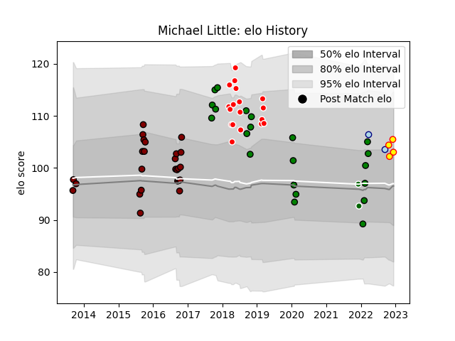

---  
layout: page  
title: Michael Little  
date: 2023-01-13 11:36:03.797292  
categories: player  
---
# Michael Little

## Positions: C

## Current elo: 93.0

## Current Percentile: 81.0

# Elo History

# Match History

| Team                  |   Appearances |   Win Rate |
|:----------------------|--------------:|-----------:|
| North Harbour         |            25 |   0.46     |
| Mitsubishi Dynaboars  |            22 |   0.681818 |
| Sunwolves             |            18 |   0.222222 |
| Richmond              |             5 |   0.3      |
| Bedford               |             3 |   0.333333 |
| Kobelco Kobe Steelers |             3 |   0.666667 |
| Ealing Trailfinders   |             2 |   1        |

| Opponent                        |   Matches |   Win Rate |
|:--------------------------------|----------:|-----------:|
| Hanazono Kintetsu Liners        |         4 |   0.75     |
| Coventry                        |         3 |   0        |
| Queensland Reds                 |         3 |   0.333333 |
| Manawatu                        |         3 |   0.333333 |
| Hino Red Dolphins               |         3 |   0.666667 |
| New South Wales Waratahs        |         3 |   0        |
| Otago                           |         3 |   0.333333 |
| Kamaishi Seawaves               |         3 |   1        |
| Canterbury                      |         3 |   0        |
| Tasman                          |         3 |   0.5      |
| Wellington                      |         3 |   0.333333 |
| Sharks                          |         2 |   0        |
| Kyuden Voltex                   |         2 |   1        |
| Northland                       |         2 |   1        |
| Southland                       |         2 |   1        |
| NTT Docomo Red Hurricanes Osaka |         2 |   0        |
| Bay of Plenty                   |         2 |   0.5      |
| Ampthill                        |         2 |   0.75     |
| Yokohama Canon Eagles           |         2 |   0        |
| Blues                           |         2 |   0        |
| Green Rockets Tokatsu           |         2 |   1        |
| Chiefs                          |         2 |   0.5      |
| Counties Manukau                |         2 |   1        |
| Kurita Water Gush               |         1 |   1        |
| Richmond                        |         1 |   1        |
| Bedford                         |         1 |   1        |
| Waikato                         |         1 |   0        |
| Toshiba Brave Lupus Tokyo       |         1 |   0        |
| Stormers                        |         1 |   1        |
| Bulls                           |         1 |   1        |
| Skyactivs Hiroshima             |         1 |   1        |
| Saitama Wild Knights            |         1 |   0        |
| Chugoku Red Regulions           |         1 |   1        |
| Lions                           |         1 |   0        |
| Nottingham                      |         1 |   0        |
| Crusaders                       |         1 |   0        |
| Hawke's Bay                     |         1 |   0        |
| Mie Honda Heat                  |         1 |   1        |
| Melbourne Rebels                |         1 |   0        |
| Mazda Blue Zoomers              |         1 |   1        |
| Hurricanes                      |         1 |   0        |
| Jersey                          |         1 |   0        |
| London Scottish                 |         1 |   1        |