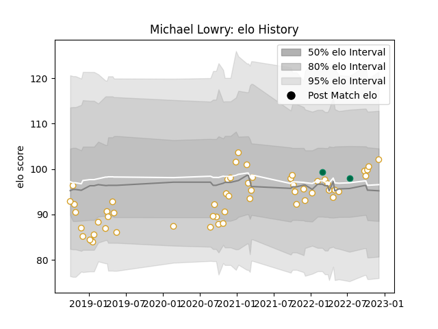

---  
layout: page  
title: Michael Lowry  
date: 2023-01-13 11:26:24.444658  
categories: player  
---
# Michael Lowry

## Positions: FB

## Country: Ireland

## Current elo: 97.0

## Current Percentile: 52.0

# Elo History

# Match History

| Team    |   Appearances |   Win Rate |
|:--------|--------------:|-----------:|
| Ulster  |            60 |   0.608333 |
| Ireland |             3 |   0.666667 |

| Opponent          |   Matches |   Win Rate |
|:------------------|----------:|-----------:|
| Leinster          |        10 |   0.3      |
| Connacht          |         6 |   0.666667 |
| Glasgow Warriors  |         5 |   0.6      |
| Benetton Treviso  |         4 |   0.625    |
| Ospreys           |         4 |   0.75     |
| Scarlets          |         3 |   0.666667 |
| Munster           |         3 |   0        |
| Zebre             |         3 |   1        |
| Edinburgh         |         3 |   1        |
| Dragons           |         3 |   1        |
| Leicester Tigers  |         2 |   1        |
| New Zealand Maori |         2 |   0.5      |
| Racing 92         |         2 |   0.5      |
| Cardiff Blues     |         2 |   1        |
| Lions             |         2 |   1        |
| Italy             |         1 |   1        |
| La Rochelle       |         1 |   0        |
| Bulls             |         1 |   0        |
| Cheetahs          |         1 |   1        |
| Sale Sharks       |         1 |   0        |
| Sharks            |         1 |   1        |
| Southern Kings    |         1 |   1        |
| Stade Toulousain  |         1 |   0        |
| Stormers          |         1 |   0        |