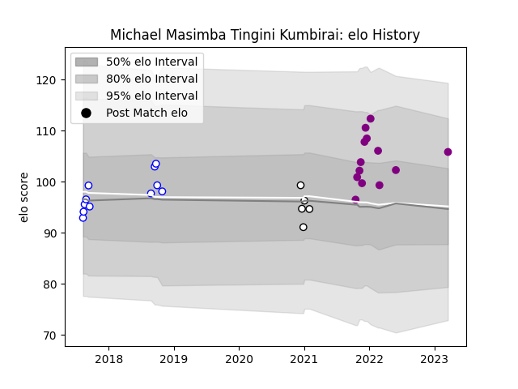

---  
layout: page  
title: Michael Masimba Tingini Kumbirai  
date: 2023-03-21 18:33:10.859614  
categories: player  
---
# Michael Masimba Tingini Kumbirai

Last updated: 2023-03-21
## Positions: P

## Current elo: 106.0

## Current Percentile: 72.0

# Elo History

# Match History

| Team             |   Appearances |   Win Rate |
|:-----------------|--------------:|-----------:|
| Soyaux-Angouleme |            13 |   0.846154 |
| Western Province |            11 |   0.636364 |
| Natal Sharks     |             5 |   0.4      |

| Opponent                   |   Matches |   Win Rate |
|:---------------------------|----------:|-----------:|
| Free State Cheetahs        |         3 |   0.666667 |
| Natal Sharks               |         3 |   0.333333 |
| Blue Bulls                 |         3 |   0.666667 |
| Griquas                    |         3 |   0.666667 |
| Golden Lions               |         3 |   0.666667 |
| Dax                        |         2 |   0.5      |
| Valence Romans Drome Rugby |         2 |   1        |
| Cognac Saint Jean d'Angély |         1 |   1        |
| Aubenas                    |         1 |   1        |
| Chambery                   |         1 |   0        |
| Grenoble                   |         1 |   1        |
| Bourgoin-Jallieu           |         1 |   1        |
| Blagnac                    |         1 |   1        |
| Pumas                      |         1 |   0        |
| Suresnes                   |         1 |   1        |
| Tarbes                     |         1 |   1        |
| Albi                       |         1 |   1        |