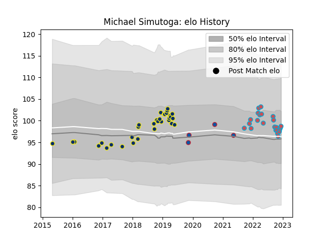

---  
layout: page  
title: Michael Simutoga  
date: 2022-12-14 11:34:18.832512  
categories: player  
---
# Michael Simutoga

## Positions: P

## Current elo: 99.0

## Current Percentile: 52.0

# Elo History

# Match History

| Team              |   Appearances |   Win Rate |
|:------------------|--------------:|-----------:|
| Clermont Auvergne |            34 |   0.647059 |
| Bourgoin-Jallieu  |            23 |   0.543478 |
| Grenoble          |             4 |   0.75     |

| Opponent                   |   Matches |   Win Rate |
|:---------------------------|----------:|-----------:|
| Pau                        |         4 |   0.75     |
| Bordeaux Begles            |         4 |   0.25     |
| Blagnac                    |         3 |   0.333333 |
| Grenoble                   |         3 |   0.833333 |
| Agen                       |         2 |   1        |
| Racing 92                  |         2 |   0.25     |
| Suresnes                   |         2 |   0.5      |
| Albi                       |         2 |   0        |
| Lyon                       |         2 |   0.5      |
| Timisoara Saracens         |         2 |   1        |
| Dragons                    |         2 |   1        |
| Dijon                      |         2 |   0.5      |
| Dax                        |         2 |   1        |
| Cognac Saint Jean d'Angély |         2 |   1        |
| Chambery                   |         2 |   0.5      |
| Castres Olympique          |         2 |   0        |
| Valence Romans Drome Rugby |         2 |   0.75     |
| Beziers                    |         2 |   0.5      |
| Bayonne                    |         2 |   0.5      |
| US Bressane                |         1 |   0        |
| Ulster                     |         1 |   1        |
| Tarbes                     |         1 |   0        |
| Stade Francais Paris       |         1 |   1        |
| Soyaux-Angouleme           |         1 |   0        |
| Rennes                     |         1 |   1        |
| Montauban                  |         1 |   1        |
| Perpignan                  |         1 |   1        |
| Ospreys                    |         1 |   0        |
| Northampton Saints         |         1 |   1        |
| Narbonne                   |         1 |   1        |
| Montpellier Herault        |         1 |   0        |
| La Rochelle                |         1 |   1        |
| Harlequins                 |         1 |   1        |
| Carqueiranne-Hyères        |         1 |   1        |
| Brive                      |         1 |   1        |
| Vannes                     |         1 |   1        |